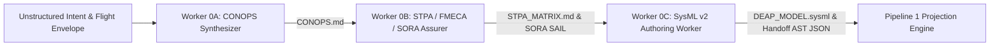
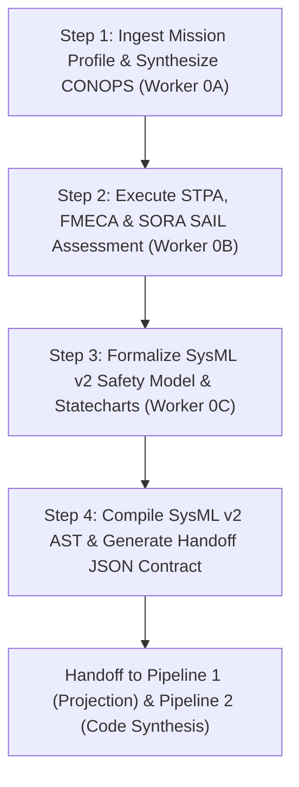

# Digital Engineering Agent Platform (DEAP) — Low-Altitude UAS Infrastructure Safety Platform

> **Repository Identifier:** `DEAP-uas-infrastructure-safety`  
> **Status:** `PRODUCTION-GRADE / ACTIVE`  
> **Classification:** `Low-Altitude UAS Infrastructure Safety & Autonomous Airspace Platform`  
> **Target Regulatory Frameworks:** `JARUS SORA v2.5 (SAIL I–VI)` | `ASTM F3269-17 RTA` | `ASTM F3411-22a Remote ID` | `RTCA DO-365B DAA`  
> **Primary Technology Profiles:** `ROS2 C++ Real-Time` | `PX4 Autopilot Flight Module`  

---

## 1. System Overview

The **DEAP Low-Altitude UAS Infrastructure Safety Platform** (`DEAP-uas-infrastructure-safety`) is a standalone downstream domain platform built on the Digital Engineering Agent Platform (DEAP) architecture. It provides an end-to-end safety assurance, detect-and-avoid (DAA), run-time assurance (RTA), and Remote ID infrastructure integration platform for uncrewed aircraft systems (UAS), urban air mobility (UAM), and autonomous flight fleets operating in low-altitude airspace.

By combining System-Theoretic Process Analysis (STPA) with Failure Mode, Effects, and Criticality Analysis (FMECA) tailored for autonomous robotics and airspace integration, this platform enforces strict SORA SAIL risk mitigations down to ROS2 C++ lifecycle nodes, PX4 flight controllers, and continuous test verification gates.

---

## 1.1 Primary Commercial Toolchain Integration

This platform explicitly declares **MATLAB / Simulink / Stateflow / Embedded Coder** as the Primary Tier-1 Commercial Toolchain Integration (Model-Based Design, Control Law Synthesis, DO-178C C/SPARK Ada Code Generation).

---

## 2. Supported Regulatory & Airspace Frameworks

| Standard | Domain & Scope | Target Assurance | DEAP Mechanical Automation |
| :--- | :--- | :--- | :--- |
| **JARUS SORA v2.5** | Specific Operation Risk Assessment | SAIL I to SAIL VI (Catastrophic / Urban Airspace) | Validates ground risk (GRC) and air risk (ARC) mitigations, TMS containment, and fail-safe Return-to-Launch (RTL) rules. |
| **ASTM F3269-17** | Run-Time Assurance (RTA) for Aircraft Systems | Non-complex safety net monitor (RTA Architecture) | Enforces deterministic fail-safe switching logic between un-verified advanced control loops and certified recovery baselines. |
| **ASTM F3411-22a** | Broadcast & Network Remote ID | Direct Broadcast & Network ASTM RID Protocol | AST linters verify 1Hz transmission frequency, location payload integrity, and cryptographic authentication tags. |
| **RTCA DO-365B** | Detect and Avoid (DAA) Systems | Minimum Operational Performance Standards (MOPS) | Validates TCAS II / ACAS sUAS alert & guidance logic, well-clear boundary boundaries, and hazard collision avoidance. |

---

## 3. Platform Technology Profiles

### 3.1 ROS2 C++ Profile (`.pipeline/profiles/ros2_cpp.md`)
- **Framework:** ROS 2 (Humble / Iron / Jazzy) with `rclcpp`
- **Execution Lifecycle:** `rclcpp_lifecycle::LifecycleNode` state machine management
- **Real-Time Memory:** Zero allocation in active control loops (`rttest` verification)
- **Communication Safety:** Hardened Quality of Service (QoS) profiles (`RELIABILITY_RELIABLE`, `TRANSIENT_LOCAL`)

### 3.2 PX4 Autopilot Profile (`.pipeline/profiles/px4_module.md`)
- **Autopilot Architecture:** PX4 Autopilot Firmware & uORB Messaging
- **Fail-Safe Management:** PX4 Flight Mode Safety Gates (Geofence, Battery, Data Link Loss, Fail-Safe RTL)
- **Interface Protocol:** MAVLink v2.0 with microRTPS / XRCE-DDS bridge
- **Hardware Integration:** STM32 / Pixhawk flight controller hardware target constraints

---

## 4. Repository Structure & Canonical Specifications

All architecture blueprints, concept papers, SysML v2 models, and specifications for DEAP are hosted centrally in the Single Source of Truth repository: **[DEAP-spec-core](https://github.com/gintatkinson/DEAP-spec-core)**.

### Canonical Specifications (hosted in `DEAP-spec-core`):
- **UAS Infrastructure Safety Concept Paper**: [DEAP_UAS_INFRASTRUCTURE_SAFETY_CONCEPT_PAPER.md](https://github.com/gintatkinson/DEAP-spec-core/blob/main/docs/architecture/blueprints/DEAP_UAS_INFRASTRUCTURE_SAFETY_CONCEPT_PAPER.md)
- **SysML v2 Textual Safety Model**: [DEAP_SYSML_V2_SAFETY_MODEL_SPECIFICATION.sysml](https://github.com/gintatkinson/DEAP-spec-core/blob/main/docs/architecture/blueprints/DEAP_SYSML_V2_SAFETY_MODEL_SPECIFICATION.sysml)
- **SysML v2 MATLAB Export Blueprint**: [DEAP_SYSML_V2_SAFETY_MODEL_SPECIFICATION.md](https://github.com/gintatkinson/DEAP-spec-core/blob/main/docs/architecture/blueprints/DEAP_SYSML_V2_SAFETY_MODEL_SPECIFICATION.md)
- **Safety-Critical Real-Time UI Framework**: [SAFETY_CRITICAL_REALTIME_UI_FRAMEWORK.md](https://github.com/gintatkinson/DEAP-spec-core/blob/main/docs/architecture/blueprints/SAFETY_CRITICAL_REALTIME_UI_FRAMEWORK.md)
- **Master Specification Sitemap**: [DEAP_SPECIFICATIONS_SITEMAP.md](https://github.com/gintatkinson/DEAP-spec-core/blob/main/docs/architecture/DEAP_SPECIFICATIONS_SITEMAP.md)

### Repository Tree:
```
DEAP-uas-infrastructure-safety/
├── .agents/
│   └── AGENTS.md                  # Project-scoped agentic governance rules & delegation gates
├── .pipeline/
│   ├── constitution.md            # Platform-independent functional safety governance tier
│   └── profiles/
│       ├── ros2_cpp.md            # ROS2 C++ Real-Time Nodes platform execution profile
│       └── px4_module.md          # PX4 Autopilot Flight Module platform execution profile
├── tests/
│   └── test_uas_safety_governance.py      # Automated UAS safety compliance & MBSE test suite
├── pyproject.toml                 # Pytest & verification configuration
└── README.md                      # Platform master specification & usage guide
```

---

## 5. Installation & Developer Quick-Start Guide

### 5.1 Prerequisites & Python 3.12 Setup

The platform requires **Python 3.12+**, the configured tracker CLI, and git. Python scripts require `PyYAML` and `pytest`.

#### Installing Python 3.12
- **macOS (Homebrew)**:
  ```bash
  brew install python@3.12
  python3.12 -m venv .venv
  source .venv/bin/activate
  pip install -r requirements.txt
  ```
- **Ubuntu / Debian**:
  ```bash
  sudo apt-get update && sudo apt-get install -y python3.12 python3.12-venv
  python3.12 -m venv .venv
  source .venv/bin/activate
  pip install -r requirements.txt
  ```

### 5.2 Turnkey 1-Line Installer (Recommended)

Run the turnkey automated installer using the portable turnkey command line:

```bash
curl -sSL https://raw.githubusercontent.com/gintatkinson/DEAP-spec-core/main/scripts/install_pipeline.sh | bash
```

> **Note**: `install_pipeline.sh` automatically provisions `.venv`, installs Python dependencies, injects pipeline governance engine tooling, configures process discipline git hooks, bootstraps tracker labels, executes safety test verification (`pytest`), and compiles MBSE SysML v2 safety models in a single automated turnkey step.

### 5.3 Setup for Google Antigravity / Gemini CLI

After copying the pipeline, configure Gemini / Antigravity to load the skills and rules:

1. **Point Gemini / Antigravity at the skills directory**:
   ```
   Read the files in ./skills/, ./.agents/skills/, and ./rules/ directories.
   ```
2. **Mandatory Post-Install Agent Initialization Sequence**:
   Immediately following turnkey installation, any AI agent (Antigravity, Claude Code, Gemini CLI, Cursor) initializing in this repository MUST execute the following 5-step sequence before accepting user directives or executing task implementations:
   1. **Read Governance Constitution**: Execute `view_file` on `.pipeline/constitution.md` to ingest the platform-independent functional governance layer and zero-mocking persistence mandates.
   2. **Load Project Skills**: Execute `view_file` on `.agents/skills/feature-driven-implementation/SKILL.md` (and any active skills under `.agents/skills/`) to initialize feature-driven implementation protocols and review gates.
   3. **Load Governance Rules**: Ingest `.agents/AGENTS.md` to enforce project-scoped agentic rules, context-isolated subagent dispatch loops, and role boundary locks.
   4. **Load Platform Profile**: Read the target platform execution profile (`.pipeline/profiles/ros2_cpp.md` for ROS2 C++ Real-Time Nodes or `.pipeline/profiles/px4_module.md` for PX4 Autopilot Flight Modules) to establish platform-specific build, test, and lifecycle constraints.
   5. **Bootstrap Tracker Labels**: Verify that repository issue tracker labels are synchronized and operational by running `python3 scripts/reconcile_backlog.py` or verifying label bootstrapping status.

### 5.4 AGENTS.md Setup

Ensure `.agents/AGENTS.md` exists in your project root to instruct initializing AI agents:

```markdown
# Agent Instructions

## Pipeline Skills & Rules
This project uses the Digital Engineering Agent Platform (DEAP).
- Skills: read all SKILL.md files in `.agents/skills/` and `skills/`
- Rules: read all files in `.agents/AGENTS.md` and `rules/`
- Constitution: read `.pipeline/constitution.md` before any task
- Profiles: read `.pipeline/profiles/ros2_cpp.md` or `.pipeline/profiles/px4_module.md` before implementing features
```

### 5.5 Setup for Claude Code

```bash
# Add to CLAUDE.md:
echo "Read all SKILL.md files in skills/ and .agents/skills/ and all rule files in rules/ before starting any task." >> CLAUDE.md
```

### 5.6 Setup for Cursor / Windsurf / Cascade

Create `.cursor/rules/pipeline.mdc` or `.windsurf/rules/pipeline.md` referencing `.agents/skills/`, `skills/`, `.agents/AGENTS.md`, and `.pipeline/`.

### 5.7 Downstream Baseline Verification Gate

The verification gate acts as a post-installation and post-implementation compliance check:

```bash
python3 -m pytest tests/
python3 scripts/verify_downstream_baseline.py --no-domain
```

### 5.8 Supported Runtimes Table

| Runtime | Subagent Dispatch | Two-Stage Review |
|---|---|---|
| **Claude Code** | `Task("prompt")` — native isolated subagent | Separate reviewer subagents |
| **Gemini CLI / Antigravity** | Subagent tool call with curated context | Separate reviewer subagents |
| **Cascade (Windsurf/Devin)** | Coordinator re-reads files per task to simulate isolation | Explicit self-audit documented in `task.md` |
| **Cursor** | Context-isolated subagent prompt execution | Sequential self-audit checklist |

---

## 6. Pipeline 0: Pre-Spec Safety Engineering Execution Workflow

Pipeline 0 (**Pre-Spec Safety Engineering Engine**) serves as the front-end systems engineering, hazard identification, and safety modeling pipeline within the Digital Engineering Agent Platform (DEAP) framework. Operating prior to downstream Agile backlog projection (Pipeline 1) and automated code synthesis (Pipeline 2), Pipeline 0 ingests unstructured customer intent, mission flight profiles, and airspace constraints to produce normative safety specifications, STPA/FMECA analysis, SORA SAIL assurance models, and SysML v2 textual AST artifacts.

### 6.1 Master-Worker Subagent Topology

Pipeline 0 deploys three specialized, context-isolated subagent workers operating in a strict serial execution loop to prevent context bloat and memory leakage:



### 6.2 Subagent Execution Roles

#### 6.2.1 Worker 0A: CONOPS & Mission Scenario Synthesizer
- **Role Description:** Context-isolated front-end synthesizer responsible for converting raw stakeholder statements, operational concepts, and mission profiles into a structured Concept of Operations (`CONOPS.md`).
- **Primary Inputs:**
  - Raw natural language prompt, stakeholder requirements, and flight mission profile.
  - Flight mission envelope parameters (altitude boundaries, speed, payload type, airspace class, population density).
  - Stakeholder role definitions (Remote Pilot, Command Center Operator, Fleet Manager, ATC/UTM interface).
- **Deliverables & Outputs:**
  - `CONOPS.md`: Structured Concept of Operations detailing mission objectives, flight operational phases (Pre-Flight, Launch, Cruise, Mission Execution, Approach, Landing, Contingency RTL), system boundaries, and environmental constraints.

#### 6.2.2 Worker 0B: STPA Hazard Analysis, FMECA & SORA SAIL Assurer
- **Role Description:** Safety engineering subagent that performs System-Theoretic Process Analysis (STPA), Failure Mode, Effects, and Criticality Analysis (FMECA), and JARUS SORA v2.5 SAIL I–VI risk assessment on the system boundary defined by Worker 0A.
- **Primary Inputs:**
  - `CONOPS.md` generated by Worker 0A.
  - Regulatory safety mandates (JARUS SORA v2.5 SAIL I–VI, ASTM F3269-17 RTA, RTCA DO-365B DAA).
- **Deliverables & Outputs:**
  - `STPA_MATRIX.md`: Comprehensive STPA hazard analysis including System Losses ($L-1..N$), System Hazards ($H-1..N$), Control Structure diagrams, Unsafe Control Actions ($UCA-1..N$), Loss Scenarios ($LS-1..N$), and mandatory Safety Constraints ($SC-1..N$).
  - **FMECA Matrix:** Component failure modes, severity/occurrence ratings, single-point failures, and criticality scores.
  - **SORA SAIL Risk Model:** Ground Risk Class (GRC), Air Risk Class (ARC), Specific Assurance and Integrity Level (SAIL I to SAIL VI) classification, and Operational Safety Objectives (OSOs).

#### 6.2.3 Worker 0C: SysML v2 Architectural & Safety Model Author
- **Role Description:** Systems architecture subagent that formalizes the CONOPS, STPA hazard matrices, FMECA ratings, and SORA SAIL requirements into normative SysML v2 textual code blocks and AST handoff contracts.
- **Primary Inputs:**
  - `CONOPS.md` from Worker 0A.
  - `STPA_MATRIX.md` and SORA SAIL risk matrices from Worker 0B.
- **Deliverables & Outputs:**
  - `DEAP_MODEL.sysml`: Standard-compliant SysML v2 model containing `package`, `req` (Safety Requirements), `part` (Subsystems & Safety Controllers), `port` (Real-Time Telemetry/Command Interfaces), `state` (Run-Time Assurance & Contingency Statecharts), and `satisfy` / `verify` traceability links.
  - `pipeline0_handoff_contract.json`: Serialized AST payload for seamless downstream projection into Pipeline 1 (Agile Epics & Features) and Pipeline 2 (ROS2 C++ & PX4 implementation).

### 6.3 Pipeline 0 Command-Line Execution Prompts

To execute Pipeline 0 via context-isolated subagents in your AI agent environment (Antigravity, Claude Code, Gemini CLI, Cursor), copy and execute the following standardized command-line execution prompts in sequence:

#### 6.3.1 Worker 0A: CONOPS & Mission Scenario Synthesis Prompt

```text
Role: Worker 0A — CONOPS & Mission Scenario Synthesizer

Primary Commercial Toolchain Integration Context:
This project explicitly declares MATLAB / Simulink / Stateflow / Embedded Coder as the Primary Tier-1 Commercial Toolchain Integration Context (Model-Based Design, Control Law Synthesis, DO-178C C/SPARK Ada code generation).

Directive:
Execute front-end CONOPS synthesis for the target UAS flight mission profile. Convert raw stakeholder intent and airspace constraints into a structured Concept of Operations (`CONOPS.md`).

1. Inputs & Constraints:
   - Ingest operational mission envelope (flight altitude boundaries, max ground speed, payload configuration, population density, BVLOS vs VLOS flight operations).
   - Identify stakeholder role definitions (Remote Pilot in Command, Fleet Operations Manager, Command Center Lead, Air Traffic Management / UTM interface).
   - Define flight operational phases (Pre-Flight Checkout, Launch/Takeoff, En-Route Cruise, Mission Execution, Approach & Landing, Fail-Safe Contingency RTL).

2. Output Requirement:
   - Generate `CONOPS.md` under `docs/conops/CONOPS.md`.
   - Ensure clear operational phase boundaries, system physical and functional boundaries, and environmental envelope constraints.
   - Include MATLAB / Simulink / Stateflow model integration baseline hooks for downstream control law synthesis.

PROCEED
```

#### 6.3.2 Worker 0B: STPA Hazard Analysis, FMECA & SORA SAIL Assurer Prompt

```text
Role: Worker 0B — STPA Hazard Analysis, FMECA & SORA SAIL Assurer

Primary Commercial Toolchain Integration Context:
This project explicitly declares MATLAB / Simulink / Stateflow / Embedded Coder as the Primary Tier-1 Commercial Toolchain Integration Context (Model-Based Design, Control Law Synthesis, DO-178C C/SPARK Ada code generation).

Directive:
Perform STPA hazard analysis, FMECA failure mode criticality evaluation, and SORA SAIL I–VI risk assessment based on `docs/conops/CONOPS.md`.

1. Standards Compliance:
   - JARUS SORA v2.5 (SAIL I through SAIL VI risk mitigations, Ground Risk Class GRC, Air Risk Class ARC, Operational Safety Objectives OSOs).
   - ASTM F3269-17 (Run-Time Assurance Monitor Architecture).
   - RTCA DO-365B (Detect and Avoid DAA MOPS & TCAS II / ACAS sUAS alert & guidance).

2. Output Requirements:
   - Generate `STPA_MATRIX.md` under `docs/safety/STPA_MATRIX.md` containing System Losses ($L-1..N$), System Hazards ($H-1..N$), Control Structure topology, Unsafe Control Actions ($UCA-1..N$), Loss Scenarios ($LS-1..N$), and Safety Constraints ($SC-1..N$).
   - Formulate FMECA Matrix detailing component failure modes, severity/occurrence ratings, single-point failures, and Risk Priority Numbers (RPN).
   - Calculate SORA SAIL classification level (SAIL I–VI) and map mandatory OSOs (OSO-01 through OSO-24).

PROCEED
```

#### 6.3.3 Worker 0C: SysML v2 Architectural & Safety Model Author Prompt

```text
Role: Worker 0C — SysML v2 Architectural & Safety Model Author

Primary Commercial Toolchain Integration Context:
This project explicitly declares MATLAB / Simulink / Stateflow / Embedded Coder as the Primary Tier-1 Commercial Toolchain Integration Context (Model-Based Design, Control Law Synthesis, DO-178C C/SPARK Ada code generation).

Directive:
Formalize the CONOPS (`CONOPS.md`), STPA hazard matrices, FMECA ratings, and SORA SAIL requirements (`STPA_MATRIX.md`) into a normative SysML v2 textual model and serialized AST handoff contract.

1. Model Engineering Mandate:
   - Construct `DEAP_MODEL.sysml` conforming to SysML v2 textual specification standards (`package`, `req`, `part`, `port`, `state`, `satisfy`, `verify`).
   - Define safety statecharts for Run-Time Assurance (RTA) switching logic, contingency flight modes, and fail-safe Return-to-Launch (RTL) transitions.
   - Establish MATLAB / Simulink / Stateflow export compatibility for DO-178C C/SPARK Ada code synthesis.

2. Output Requirements:
   - Generate `DEAP_MODEL.sysml` under `docs/architecture/blueprints/DEAP_MODEL.sysml`.
   - Generate `pipeline0_handoff_contract.json` under `.pipeline/contracts/pipeline0_handoff_contract.json` for downstream Pipeline 1 Agile projection and Pipeline 2 code generation.

PROCEED
```

### 6.4 Pipeline 0 Execution Steps & Handoff Workflow



### 6.4 Pipeline 0 Handoff JSON Contract (`pipeline0_handoff_contract.json`)

The interface between Pipeline 0 safety modeling, Pipeline 1 specification engineering, and Pipeline 2 ROS2/PX4 safety implementation is strictly governed by `pipeline0_handoff_contract.json`:

```json
{
  "$schema": "https://deap.engine/schemas/pipeline0_handoff_v1.json",
  "metadata": {
    "identifier": "DEAP-PIPELINE-0-HANDOFF-001",
    "timestamp": "2026-08-11T00:00:00Z",
    "source_model": "DEAP_MODEL.sysml",
    "governance_status": "APPROVED",
    "regulatory_target": ["ARP4754A", "ARP4761", "JARUS SORA v2.5", "DO-178C", "DO-254", "ASTM F3269"]
  },
  "conops_summary": {
    "document_path": "docs/conops/CONOPS.md",
    "mission_type": "UAS BVLOS Urban Infrastructure Inspection",
    "operational_phases": ["PRE_FLIGHT", "TAKEOFF", "CRUISE", "INSPECTION", "APPROACH", "LANDING", "RTA_BACKUP"]
  },
  "safety_matrix": {
    "document_path": "docs/safety/STPA_MATRIX.md",
    "system_losses": [
      { "id": "L-1", "title": "Loss of Aircraft Control / Uncontrolled Flight Into Terrain (UFIT)" },
      { "id": "L-2", "title": "Airspace Collision with Manned Aircraft" }
    ],
    "hazards": [
      { "id": "H-1", "loss_refs": ["L-1"], "title": "Flight Controller Command Saturation during High-Wind Turbulence" },
      { "id": "H-2", "loss_refs": ["L-2"], "title": "Loss of Remote ID & DAA Telemetry Stream" }
    ],
    "unsafe_control_actions": [
      {
        "id": "UCA-1",
        "hazard_ref": "H-1",
        "control_action": "Execute Pitch Command",
        "failure_mode": "Provided Wrong / Out of Range",
        "safety_constraint": "SC-1: Pitch command must be rate-limited and bounded by pitch envelope protection safety statechart."
      }
    ]
  },
  "sysml_ast_export": {
    "requirements": [
      {
        "id": "REQ-SYS-001",
        "name": "EnvelopeProtectionRequirement",
        "text": "The flight control system shall enforce pitch angle limits between -15 deg and +25 deg.",
        "stpa_ref": "SC-1",
        "dal": "DAL A"
      }
    ],
    "parts": [
      {
        "id": "PART-SYS-001",
        "name": "FlightControlSystem",
        "ports": ["p_telemetry", "p_actuator_cmd"],
        "subparts": ["PrimaryController", "RunTimeAssuranceMonitor"]
      }
    ],
    "statecharts": [
      {
        "name": "SafetyModeStatechart",
        "states": ["NORMAL", "DEGRADED", "RTA_BACKUP_ENGAGED", "EMERGENCY_FAILSAFE"]
      }
    ]
  }
}
```

---

## 7. Next Steps — Developer & Agent Execution Workflows

Once turnkey installation is complete, select your target execution workflow:

### 7.1 Option A: Run Safety Governance Verification
Verify that all SORA SAIL risk mitigations, ROS2 C++ lifecycle parameters, and PX4 flight mode safety constraints are compliant:
```bash
python3 -m pytest tests/
```

### 7.2 Option B: Execute Feature Implementation (Agentic Workflow)
Prompt your AI Agent (Antigravity, Claude Code, Gemini CLI, Cursor) to implement prioritized backlog features targeting `ros2_cpp` or `px4_module`:

> **Feature Implementation Prompt:**
>
> "Adopt the feature-driven-implementation skill by executing view_file on 
> `.agents/skills/feature-driven-implementation/SKILL.md` as step 1.
>
> I want to implement Feature [Issue Number, e.g. #1] targeting platform profile [.pipeline/profiles/ros2_cpp.md | .pipeline/profiles/px4_module.md].
>
> 1. Read `.pipeline/constitution.md` and target profile rules.
> 2. Enforce 3-Layer Definition of Done (Domain Model -> Safety Statechart/ViewModel -> ROS2/PX4 Interface Binding + BDD Test).
> 3. Execute TDD RED-GREEN micro-tasks using context-isolated subagents.
> 4. Verify test suite and deliver walkthrough."

### 7.3 Option C: Verify Downstream Baseline Conformance
Run the post-implementation compliance gate:
```bash
python3 scripts/verify_downstream_baseline.py --no-domain
```

---

## 8. License & Governance

Governed under the **Digital Engineering Agent Platform (DEAP)** specification framework. All safety claims and traceability tags are mechanically validated on commit.
