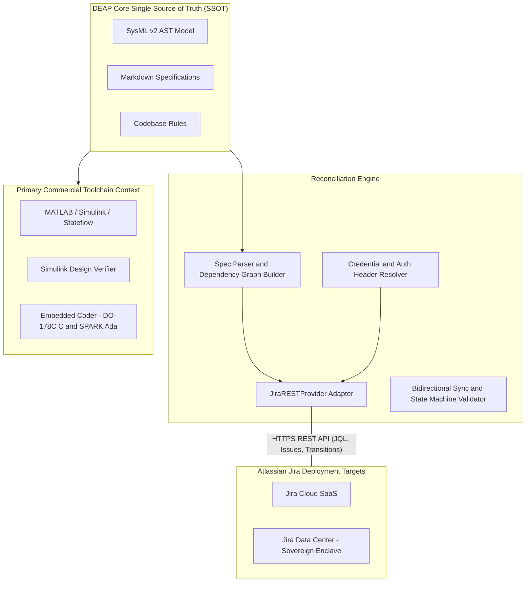
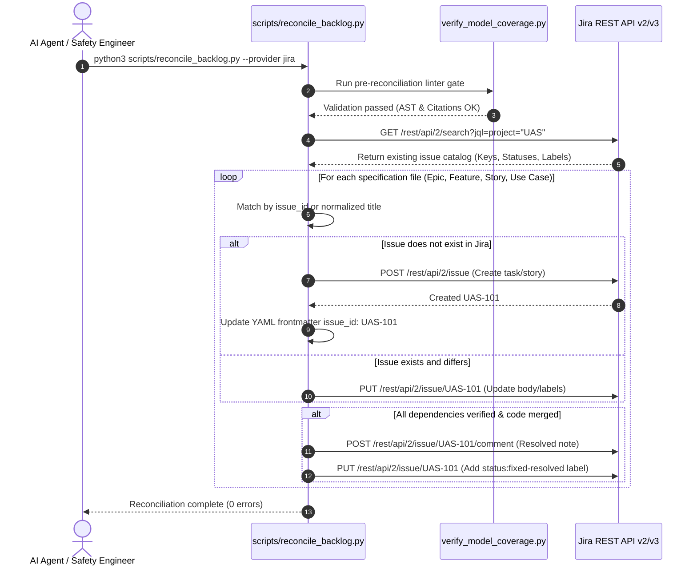

# DEAP Customer Integration Guide: Jira Cloud & Jira Data Center Integration

> **Document Identifier:** `DEAP-GUIDE-JIRA-001`  
> **Status:** `APPROVED / PRODUCTION-GRADE`  
> **Classification:** `Enterprise Multi-Provider Issue Tracker Integration Guide`  
> **Target Platforms:** `Jira Cloud (Free / Standard / Premium / Enterprise)` | `Jira Data Center (On-Premises / AWS / Azure)` | `Jira Server (Legacy)`  
> **Target Standards:** `Jira REST API v2 / v3` | `RFC 7617 (Basic Auth)` | `RFC 6750 (Bearer Token)` | `ISO/IEC/IEEE 15288:2023` | `RTCA DO-178C / DO-331` | `ASTM F3269-17 RTA` | `JARUS SORA v2.5`

---

## 1. Executive Summary & Integration Architecture

The **Digital Engineering Agent Platform (DEAP)** provides native, zero-dependency bi-directional synchronization between local safety-critical system specifications (Epics, Features, User Stories, Use Cases) and enterprise issue tracking systems.

While open-source and early-stage research teams frequently operate on GitHub Issues or GitLab Issues, enterprise aerospace, defense, and industrial autonomy programs standardly rely on **Atlassian Jira Cloud** or on-premises **Jira Data Center**. DEAP's Native Jira Provider (`JiraRESTProvider`) connects directly to Jira's REST API using pure Python standard library capabilities (`urllib.request`), eliminating brittle external CLI binaries, third-party package dependencies, and complex webhook infrastructures.



---

## 2. Supported Jira Editions & Authentication Schemes

DEAP supports both Atlassian Jira Cloud and Jira Data Center / Jira Server:

| Feature / Dimension | Jira Cloud (Free / Standard / Enterprise) | Jira Data Center (Self-Hosted / GovCloud) |
| :--- | :--- | :--- |
| **API Endpoint** | `https://<org>.atlassian.net/rest/api/2/` or `3` | `https://jira.<internal-corp>/rest/api/2/` |
| **Authentication Scheme** | **Basic Authentication** (`email:api_token`) | **Personal Access Token (PAT)** (`Bearer <token>`) or Basic Auth |
| **Identity Identifier** | Atlassian Account Email (`user@company.com`) | Username or Kerberos/SAML SSO Principal |
| **Credential Storage** | Environment Variables, `.netrc`, or CI/CD Secrets | Environment Variables, `.netrc`, or CI/CD Secrets |
| **Network Egress** | Public Internet (TLS 1.3 / WebPKI) | Corporate Intranet, VPN, or Air-Gapped SCIF (Custom Root CA) |
| **Issue Key Scheme** | `PROJECT-123` (Alphanumeric Prefix + Sequential Integer) | `PROJECT-123` (Alphanumeric Prefix + Sequential Integer) |

---

## 3. Step-by-Step API Token Generation

### 3.1 Jira Cloud API Token Generation

1. Log in to your Atlassian Account at [https://id.atlassian.com/manage-profile/security/api-tokens](https://id.atlassian.com/manage-profile/security/api-tokens).
2. Click **Create API token**.
3. In the **Label** dialog, enter a descriptive name (e.g. `DEAP-Pipeline-Reconciler`).
4. Click **Create**, then click **Copy** to copy the generated token string.
5. Save the token securely in your password manager or CI/CD secret vault.

> [!IMPORTANT]
> Jira Cloud API tokens must be used in conjunction with your Atlassian account email address (`JIRA_EMAIL`) using HTTP Basic authentication.

### 3.2 Jira Data Center / Server Personal Access Token (PAT) Generation

1. Log in to your Jira Data Center instance (e.g., `https://jira.internal.corp`).
2. Click on your profile avatar in the upper-right corner and select **Profile**.
3. In the left navigation menu, click **Personal Access Tokens**.
4. Click **Create token**.
5. Give the token a name and optional expiration date, then click **Create**.
6. Copy the token immediately.

> [!NOTE]
> Jira Data Center PATs authenticate directly using standard HTTP `Authorization: Bearer <token>` headers without requiring an email prefix.

---

## 4. Environment Variables Configuration

DEAP's Jira provider automatically ingests the following standard environment variables:

| Variable Name | Required | Description | Example Value |
| :--- | :--- | :--- | :--- |
| `JIRA_SERVER_URL` | **Yes** | Base URL of your Jira instance | `https://my-company.atlassian.net` or `https://jira.internal.defense.gov` |
| `JIRA_PROJECT_KEY` | **Yes** | The project key code in Jira | `UAS`, `SAFE`, `DEAP`, `AV5` |
| `JIRA_EMAIL` | Cloud only | Atlassian account email address | `lead-engineer@my-company.com` |
| `JIRA_API_TOKEN` | **Yes** | Atlassian Cloud API Token or Data Center PAT | `ATATT3xFfGF0...` (Cloud) or `Mzk1...` (Data Center) |
| `JIRA_CA_CERT_PATH` | Optional | Path to custom SSL root certificate authority bundle for self-hosted instances | `/etc/ssl/certs/enterprise-internal-ca.crt` |

### 4.1 Shell Environment Configuration (`~/.zshrc` or `~/.bashrc`)

Add the following export statements to your shell profile:

```bash
# Jira Cloud Configuration
export JIRA_SERVER_URL="https://your-domain.atlassian.net"
export JIRA_PROJECT_KEY="UAS"
export JIRA_EMAIL="engineer@your-domain.com"
export JIRA_API_TOKEN="your_jira_api_token_here"
```

For Jira Data Center (PAT Authentication):

```bash
# Jira Data Center Configuration
export JIRA_SERVER_URL="https://jira.internal.defense.gov"
export JIRA_PROJECT_KEY="UAS"
export JIRA_API_TOKEN="your_personal_access_token_here"
export JIRA_CA_CERT_PATH="/etc/ssl/certs/internal-ca.pem"
```

---

## 5. Secure `.netrc` Credential Management

To avoid exposing secrets in shell histories or process tables, DEAP supports standard UNIX `~/.netrc` authentication resolution according to IEEE POSIX / RFC 4627 standards.

### 5.1 Configuring `~/.netrc` for Jira Cloud

Create or edit `~/.netrc`:

```netrc
machine your-domain.atlassian.net
    login engineer@your-domain.com
    password your_jira_api_token_here
```

### 5.2 Configuring `~/.netrc` for Jira Data Center

```netrc
machine jira.internal.defense.gov
    login engineer
    password your_personal_access_token_here
```

### 5.3 Enforcing Strict File Permissions

POSIX standards mandate that `~/.netrc` must be readable only by its owner. Enforce this via:

```bash
chmod 600 ~/.netrc
```

---

## 6. Codebase Rules Configuration (`codebase_rules.json`)

To configure your repository for Jira tracking, declare `tracker_rules` in `codebase_rules.json` (or `.pipeline/logical-ui/codebase_rules.json`).

### 6.1 Jira Cloud Configuration Example

```json
{
  "meta": {
    "version": "1.0.0",
    "description": "Downstream UAS Infrastructure Safety Project Governance Rules",
    "upstream_repository": "gintatkinson/DEAP-uas-infrastructure-safety"
  },
  "tracker_rules": {
    "provider": "jira",
    "server_url": "https://your-domain.atlassian.net",
    "project_key": "UAS",
    "email": "engineer@your-domain.com",
    "issue_id_placeholder": "#[IssueID]",
    "prefix_normalization_regex": "^(epic|feature|feat|user[- ]story|use[- ]case|us|uc)[s]?(?:[- ]*\\d+\\s*[:\\-]?|:)\\s*",
    "numeric_prefix": "",
    "alphanumeric_prefix": "",
    "keys": {
      "issue_id": "key",
      "title": "summary",
      "labels": "labels",
      "state": "status",
      "closed_state_value": "CLOSED",
      "open_state_value": "OPEN"
    },
    "labels": {
      "epic": "epic",
      "feature": "feature",
      "user_story": "user-story",
      "use_case": "use-case",
      "ready_for_review": "status:ready-for-review",
      "resolved": "status:fixed-resolved"
    },
    "close_comments": {
      "epic": "Epic completed. All constituent features successfully delivered and verified.",
      "user_story": "Resolved. All dependent features/tasks for BDD scenario '{title}' have been completed and verified.",
      "use_case": "Resolved. All dependent user stories and features for use case '{title}' are completed."
    }
  },
  "backlog_directories": {
    "epics": "docs/epics",
    "features": "docs/features",
    "user_stories": "docs/user-stories",
    "use_cases": "docs/use-cases",
    "schemas": "schema"
  }
}
```

---

## 7. Running Backlog Reconciliation with Jira

Execute the reconciliation engine with the `--provider jira` CLI option or rely on auto-detection:

### 7.1 Command Line Invocations

```bash
# 1. Reconcile with explicit provider flag
python3 scripts/reconcile_backlog.py --provider jira

# 2. Reconcile with explicit server and project overrides
python3 scripts/reconcile_backlog.py --provider jira \
    --jira-url https://my-company.atlassian.net \
    --jira-project UAS \
    --jira-email engineer@my-company.com

# 3. Dry-run / Offline Mode (local validation without network calls)
python3 scripts/reconcile_backlog.py --provider jira --offline
```

### 7.2 Reconciliation Workflow Execution Sequence



---

## 8. Installing Downstream Workspaces with Jira Configuration

The downstream installer script `scripts/install_pipeline.sh` provides first-class CLI options for provisioning workspaces with Jira:

```bash
# Install pipeline configured for Jira Cloud
./scripts/install_pipeline.sh \
    --tracker jira \
    --jira-url https://your-domain.atlassian.net \
    --jira-project UAS \
    --jira-email engineer@your-domain.com \
    /path/to/target-workspace

# Verify the newly installed downstream baseline
cd /path/to/target-workspace
python3 -m pytest tests/
python3 scripts/verify_downstream_baseline.py --no-domain
```

---

## 9. Troubleshooting & Common Questions

### 9.1 `HTTP 401 Unauthorized`
- **Cause:** Invalid API token, incorrect email, or token expired.
- **Fix:** Verify that `JIRA_EMAIL` matches the Atlassian Account email exactly and regenerate the API token.

### 9.2 `HTTP 403 Forbidden`
- **Cause:** Account lacks project permission (e.g. Create Issue or Edit Issue permissions in Jira project permission scheme).
- **Fix:** Ensure the Jira account has `Browse Projects`, `Create Issues`, `Edit Issues`, and `Add Comments` permissions in project `JIRA_PROJECT_KEY`.

### 9.3 `HTTP 400 Bad Request: Project does not exist`
- **Cause:** `JIRA_PROJECT_KEY` is mistyped or does not exist.
- **Fix:** Verify that the project key exists by navigating to `https://<your-domain>.atlassian.net/browse/<PROJECT_KEY>`.

### 9.4 Self-Signed Certificate Errors on Jira Data Center
- **Cause:** Corporate SSL interception proxy or custom internal CA not in standard trust store.
- **Fix:** Set `export JIRA_CA_CERT_PATH=/path/to/corporate-ca.crt` or `export SSL_CERT_FILE=/path/to/corporate-ca.crt`.

---

## 10. Primary Commercial Toolchain Context

This integration operates in tandem with DEAP's **Primary Tier-1 Commercial Toolchain Integration Context**:
**MATLAB / Simulink / Stateflow / Embedded Coder** (Model-Based Design, Control Law Synthesis, DO-178C C/SPARK Ada code generation).

All Jira items synchronized through DEAP maintain end-to-end mathematical and architectural traceability to formal SysML v2 AST models, STPA hazard scenarios ($UCA-1..N$), FMECA criticality records, and SORA SAIL compliance objectives (OSO-01 through OSO-24).
