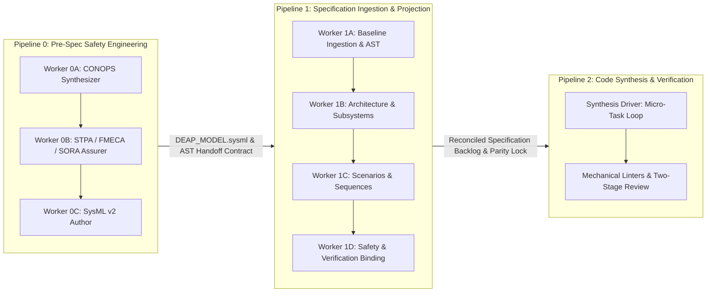

# DEAP Standardized Operator Usage Prompt Catalog

> **Primary Commercial Toolchain Integration Context:** MATLAB / Simulink / Stateflow / Embedded Coder (Model-Based Design, Control Law Synthesis, DO-178C C / SPARK Ada Code Generation)  
> **Applicable Workspaces:** Digital Engineering Agent Platform (DEAP) Specification & Implementation Repositories  
> **Governance References:** `.pipeline/constitution.md` | `rules/sysml-ssot-completeness.md` | `skills/spec-orchestrator/SKILL.md` | `skills/feature-driven-implementation/SKILL.md`

---

## 1. Overview & Operational Architecture

The Digital Engineering Agent Platform (DEAP) operates via a deterministic, multi-stage pipeline architecture bridging upstream safety engineering, architectural specification, and downstream autonomous code synthesis:



This catalog provides canonical, copy-pasteable execution prompts for human operators and automated orchestrators running **Pipeline 1** (Specification Ingestion & Agile Backlog Projection) and **Pipeline 2** (Code Synthesis & Verification Implementation Loop).

---

## 2. Pipeline 1 — Specification Ingestion & Agile Backlog Projection

Pipeline 1 systematically projects upstream SysML v2 architectural models, SORA safety parameters, and interface schemas into a fully verified, traceable Agile backlog of Epics, Features, User Stories, and Use Cases.

### 2.1 Pipeline 1 — Worker 1A: Baseline Schema Ingestion & AST Extraction

#### Role & Purpose
Worker 1A executes the baseline ingestion phase, converting multi-format domain schemas (OMG IDL, AUTOSAR ARXML, Protobuf, OpenAPI, YANG, or native SysML v2) and upstream Pipeline 0 handoff contracts (`.pipeline/contracts/pipeline0_handoff_contract.json`) into the canonical SysML v2 textual model (`.pipeline/schema.sysml`) and computing its cryptographic AST digest (`.pipeline/schema-digest.json`).

#### Operator Invocation Prompt

```text
Role: Pipeline 1 — Worker 1A: Baseline Schema Ingestion & AST Extraction

Primary Commercial Toolchain Integration Context:
This project explicitly declares MATLAB / Simulink / Stateflow / Embedded Coder as the Primary Tier-1 Commercial Toolchain Integration Context (Model-Based Design, Control Law Synthesis, DO-178C C/SPARK Ada code generation).

Directive:
Execute baseline schema ingestion and AST extraction to establish the 100% SysML v2 Single Source of Truth (SSOT) model:

1. Ingestion Sources & Pre-computation:
   - Ingest upstream handoff contract: `.pipeline/contracts/pipeline0_handoff_contract.json` (if present).
   - Ingest structural interface schemas from `schema/` (*.sysml, *.idl, *.proto, *.arxml, *.json, *.yaml).
   - Ingest upstream safety matrices from `docs/safety/STPA_MATRIX.md` and operational CONOPS from `docs/conops/CONOPS.md`.
   - Extract empirical physical constants, operational thresholds, and verbatim citations into `schema/ground_truth.json` adhering to `.pipeline/ground_truth.schema.json`.
   - If YANG schemas exist, execute YANG compilation to generate `.pipeline/logical-ui/logical-layout.json` (or `app_flutter/assets/logical-layout.json`).

2. Execution Command:
   Execute the automated SysML v2 ingestion tool:
   python3 skills/spec-orchestrator/scripts/sysmlv2_ingest.py --schema schema/ --format auto --out .pipeline/schema.sysml --digest .pipeline/schema-digest.json

3. Verification Gate:
   - Verify that `.pipeline/schema.sysml` contains valid SysML v2 AST nodes: `package`, `part def`, `item def`, `action def`, `state def`, `port def`, `requirement def`, and `use case def`.
   - Verify that `.pipeline/schema-digest.json` records SHA-256 integrity hashes for all ingested definitions.
   - Run ground-truth fact table and citation validation:
     python3 scripts/verify_ground_truth.py --strict
   - Assert zero syntax errors, 100% schema parse coverage, and zero ungrounded constants before handoff to Worker 1B.

PROCEED
```

---

### 2.2 Pipeline 1 — Worker 1B: Semantic Architecture & Subsystem Mapping (Epics & Features)

#### Role & Purpose
Worker 1B performs structural extraction and semantic architecture mapping. It maps SysML v2 `package` and `capability def` declarations into top-level Agile **Epics**, and maps `part def` (structural components) and `item def` (data payloads) AST elements into granular Agile **Features** with Given-When-Then acceptance criteria, UML Class Diagrams, Component Interfaces, and State Machine Diagrams.

#### Operator Invocation Prompt

```text
Role: Pipeline 1 — Worker 1B: Semantic Architecture & Subsystem Mapping (Epics & Features)

Primary Commercial Toolchain Integration Context:
This project explicitly declares MATLAB / Simulink / Stateflow / Embedded Coder as the Primary Tier-1 Commercial Toolchain Integration Context (Model-Based Design, Control Law Synthesis, DO-178C C/SPARK Ada code generation).

Directive:
Adopt the `schema-specification-engineering` skill and extract all Epics and Features from the SysML v2 AST model (`.pipeline/schema.sysml`) and structural schemas:

1. Structural Extraction & Isolation Mandate:
   - Partition the system into subsystem Bounded Contexts derived from SysML `package` boundaries.
   - For EACH Epic, dispatch a context-isolated subagent to generate `docs/epics/epic-XX-name.md` containing subsystem capability allocations, UML class diagrams, and component boundary definitions.
   - For EACH Feature (`part def` / `item def`), dispatch a fresh context-isolated subagent to generate `docs/features/feat-XX-name.md`.
   - Frontmatter Requirement: Ensure every markdown document includes `generation_mode: "subagent"` in its YAML frontmatter.

2. Content & Syntax Specifications:
   - Capture all mathematical constraints, value ranges, units, and default values without heuristic summarization.
   - Include complete UML Class Diagrams (`classDiagram`) and State Machine Diagrams (`stateDiagram-v2`) with valid Mermaid headers.
   - Enforce Mermaid syntax constraints: quote labels containing comparison operators or guards (e.g., `"val < max"`).

3. Local Verification & Issue Creation:
   - Run model coverage check locally:
     ./skills/spec-orchestrator/scripts/verify_model_coverage.py --spec-only --allow-missing-specs
   - Register Features first using:
     ./skills/spec-orchestrator/scripts/create_issue.sh "<local-feature-file>" "feature" "<Title>"
   - Inject created Feature Issue IDs into Epic tasklists.
   - Register Epics using:
     ./skills/spec-orchestrator/scripts/create_issue.sh "<local-epic-file>" "epic" "<Title>"
   - Perform closed-loop verification: `gh issue view <ID> --json body` to ensure non-empty tracker bodies.

PROCEED
```

---

### 2.3 Pipeline 1 — Worker 1C: Dynamic Scenario & Sequence Modeling (User Stories & Use Cases)

#### Role & Purpose
Worker 1C handles behavioral and interaction modeling. It parses SysML v2 `action def`, `state def`, `port def`, and `interaction def` nodes to engineer BDD **User Stories** (with UML Sequence Diagrams and calculation/lifecycle expiration scenarios). It then parses `use case def` blocks (`subject`, `actor`, `objective`, `include`/`extend`) to generate formal UML System **Use Cases** with Cockburn-style flows and comprehensive Realization Matrices.

#### Operator Invocation Prompt

```text
Role: Pipeline 1 — Worker 1C: Dynamic Scenario & Sequence Modeling (User Stories & Use Cases)

Primary Commercial Toolchain Integration Context:
This project explicitly declares MATLAB / Simulink / Stateflow / Embedded Coder as the Primary Tier-1 Commercial Toolchain Integration Context (Model-Based Design, Control Law Synthesis, DO-178C C/SPARK Ada code generation).

Directive:
Adopt the `spec-user-story-engineering` and `spec-usecase-engineering` skills to extract behavioral User Stories and System Use Cases:

1. Behavioral Extraction (User Stories):
   - Ingest `.pipeline/schema.sysml` and operational text.
   - Identify deployment scenarios, mathematical calculations/derivations, and temporal/state expiration lifecycles.
   - For EACH User Story, dispatch a context-isolated subagent to draft `docs/user-stories/us-XX-name.md` containing BDD Given-When-Then criteria, typed lifelines (`actorName : Classifier`), and Mermaid sequence diagrams (`sequenceDiagram`).
   - Link acceptance criteria to formal SysML `test case def` declarations with `verify requirement` bindings.
   - Register User Stories via `./skills/spec-orchestrator/scripts/create_issue.sh "<file>" "user-story" "<Title>"`.

2. Interaction Extraction (System Use Cases):
   - Parse formal `use case def` blocks in `.pipeline/schema.sysml`.
   - For EACH Use Case, dispatch a context-isolated subagent to draft `docs/use-cases/uc-XX-name.md`.
   - Detail Primary/Secondary Actors, Preconditions, Trigger, Main Success Scenario, Alternate/Exception Flows (with constraint-to-flow parity), and Postconditions.
   - Construct the `## Realization Matrix` linking specific `#IssueID`s and URLs for all constituent User Stories and Features.
   - Register Use Cases via `./skills/spec-orchestrator/scripts/create_issue.sh "<file>" "use-case" "<Title>"`.

3. Parity Validation:
   - Run: `./skills/spec-orchestrator/scripts/verify_model_coverage.py --spec-only --allow-missing-specs`
   - Confirm all cross-references between Use Cases, User Stories, Features, and Epics resolve without stubs or broken links.

PROCEED
```

---

### 2.4 Pipeline 1 — Worker 1D: Safety Invariant & RTA Verification Binding (STPA & Test Cases)

#### Role & Purpose
Worker 1D binds safety invariants, STPA hazard constraints, and SORA SAIL requirements directly to the specification matrix. It executes closed-loop reverse synchronization back into the SysML v2 SSOT (`compile_sysml.py --reverse-sync`), runs 22-gate parity lock verification (`verify_model_coverage.py --spec-only`), and executes backlog reconciliation (`reconcile_backlog.py`) across GitHub / GitLab issue trackers.

#### Operator Invocation Prompt

```text
Role: Pipeline 1 — Worker 1D: Safety Invariant & RTA Verification Binding (STPA & Test Cases)

Primary Commercial Toolchain Integration Context:
This project explicitly declares MATLAB / Simulink / Stateflow / Embedded Coder as the Primary Tier-1 Commercial Toolchain Integration Context (Model-Based Design, Control Law Synthesis, DO-178C C/SPARK Ada code generation).

Directive:
Adopt the `spec-implementation-auditor` and `spec-orchestrator` skills to execute closed-loop reconciliation, safety invariant binding, and 22-gate parity verification:

1. Safety Invariant & RTA Binding:
   - Ingest `docs/safety/STPA_MATRIX.md` (System Losses, Hazards, UCAs, Loss Scenarios, Safety Constraints $SC-1..N$, FMECA matrix, SORA OSO-01..24).
   - Ensure all safety-critical User Stories and Features carry formal bindings: `/// Safety-Realises: [SORA-GRC-XXX/UCA-Y]`.
   - Verify ASTM F3269-17 Run-Time Assurance (RTA) Safety Net switching logic and Stateflow supervisor hooks.

2. Closed-Loop Reverse Synchronization:
   Execute reverse compilation to sync markdown-elaborated components and invariants back to SysML v2:
   python3 scripts/compile_sysml.py --reverse-sync

3. 22-Gate Parity Lock Verification:
   Execute the full specification coverage gate:
   ./skills/spec-orchestrator/scripts/verify_model_coverage.py schema/ docs/features/ --spec-only
   Assert exit code 0 and 100% schema coverage across all 22 verification gates.

4. Ground-Truth Fact & AST Citation Gate:
   Execute ground-truth fact table and citation validation:
   python3 scripts/verify_ground_truth.py --strict
   Assert exit code 0 and zero ungrounded or fabricated constants.

5. Backlog Reconciliation:
   Execute tracker synchronization:
   ./scripts/reconcile_backlog.py
   (For GitLab or SCIF environments, supply `--provider gitlab` and `--gitlab-url` as required).

PROCEED
```

---

## 3. Pipeline 2 — Code Synthesis & Verification Implementation Loop

Pipeline 2 consumes the approved, verified specification backlog produced by Pipeline 1 and executes serial, TDD-disciplined code synthesis, mechanical linter validation, and formal verification.

### 3.1 Pipeline 2 — Synthesis Driver: Micro-Task Implementation Loop

#### Role & Purpose
The Synthesis Driver executes the end-to-end implementation lifecycle for prioritized Agile features. It breaks approved feature specifications into sequential 2-5 minute micro-tasks, dispatches fresh context-isolated implementer subagents under strict TDD RED-GREEN-REFACTOR cycles, conducts two-stage reviews (Spec Compliance & Code Quality), executes mechanical safety linters, compiles solution walkthroughs (`feat-<Issue_Number>-solution.md`), and updates tracker states to `Fixed / Resolved`.

#### Operator Invocation Prompt

```text
Role: Pipeline 2 — Synthesis Driver: Micro-Task Implementation Loop

Primary Commercial Toolchain Integration Context:
This project explicitly declares MATLAB / Simulink / Stateflow / Embedded Coder as the Primary Tier-1 Commercial Toolchain Integration Context (Model-Based Design, Control Law Synthesis, DO-178C C/SPARK Ada code generation).

Target Platform Profile:
Ingest target execution profile: `.pipeline/profiles/ros2_cpp.md` | `.pipeline/profiles/px4_module.md` | `.pipeline/profiles/flutter.md`

Directive:
Adopt the `feature-driven-implementation` skill and execute autonomous delivery for the prioritized target feature:

1. Pre-Flight & "The Grill" Plan Review:
   - Read `.pipeline/constitution.md` (Section 1.9 Zero-Mocking Live Persistence Mandate).
   - Checkout dedicated feature branch.
   - Formulate `implementation_plan.md` detailing vertical architectural layers (Domain Model, Statecharts/ViewModel, Interface/LUI Bindings).
   - Decompose into micro-tasks (2–5 minutes each) with exact target files, driving tests, and verification commands.

2. Mandatory Subagent Dispatch Governance Preamble:
   Every implementer subagent prompt MUST include the complete un-degraded preamble:
   ------------------------------------------------------------
   Adopt the feature-driven-implementation skill.
   Execute view_file on skills/feature-driven-implementation/SKILL.md as step 1.
   Follow Section 1.9 Zero-Mocking Live Persistence Mandate from .pipeline/constitution.md.
   Enforce the 3-Layer Definition of Done (DoD).
   Follow strict TDD RED-GREEN-REFACTOR cycle.
   Verify with build/test commands: [Profile-Specific Test Runner].
   ---GOVERNANCE-END---
   ------------------------------------------------------------
   The subagent MUST echo back a governance acknowledgment prior to writing code.

3. Micro-Task Execution Loop:
   - RED: Write failing unit test covering Happy Path and exception/alternate flows.
   - GREEN: Write minimal code to pass test.
   - REFACTOR: Optimize and clean up while preserving green test state.
   - Stage 1 Review: Spec compliance & UML traceability (`/// Realises: [Spec/Class]`).
   - Stage 2 Review: Code quality, strict typing, zero dynamic heap violations.

4. Mechanical Verification Gates:
   - Run full unit/integration test suite: `pytest tests/` or platform test runner.
   - Run downstream baseline verification: `python3 scripts/verify_downstream_baseline.py --no-domain`.
   - Run domain-specific safety linters (e.g., ASTM F3269-17 RTA, DO-365B DAA).

5. Release, Walkthrough & Resolution:
   - Merge feature branch into default branch.
   - Create cumulative solution walkthrough: `docs/designs/feat-<Issue_Number>-solution.md` with Code Realization Table.
   - Run `./scripts/reconcile_backlog.py` to sync checkboxes and mark issue `Fixed / Resolved` (apply `status:fixed-resolved` label).

PROCEED
```

---

## 4. Operator Verification & Governance Checklist

Before concluding any orchestration session, the human operator or supervising agent must verify:

| Step | Check Description | Verification Command / Metric |
| :--- | :--- | :--- |
| **G-1** | SysML v2 SSOT Model Completeness | `.pipeline/schema.sysml` and `.pipeline/schema-digest.json` exist |
| **G-2** | 22-Gate Parity Lock Verification | `./skills/spec-orchestrator/scripts/verify_model_coverage.py --spec-only` exits 0 |
| **G-3** | Ground-Truth AST Citation Integrity | `python3 scripts/verify_ground_truth.py --strict` exits 0 |
| **G-4** | Subagent Context Isolation | Every spec markdown contains `generation_mode: "subagent"` |
| **G-5** | Mathematical KaTeX Delimiters | `pytest tests/test_baseline.py -k test_latex_katex_integrity` passes |
| **G-6** | Realization Matrix Link Integrity | All `#IssueID`s in Use Cases resolve to live tracker issues |
| **G-7** | TDD Verification & Zero Mocking | Unit test suites pass with live emulators/framework test runners |
| **G-8** | Downstream Baseline Conformance | `python3 scripts/verify_downstream_baseline.py --no-domain` exits 0 |
| **G-9** | Issue Tracker State Governance | Issues marked `status:fixed-resolved` (agent never sets `Closed`) |
