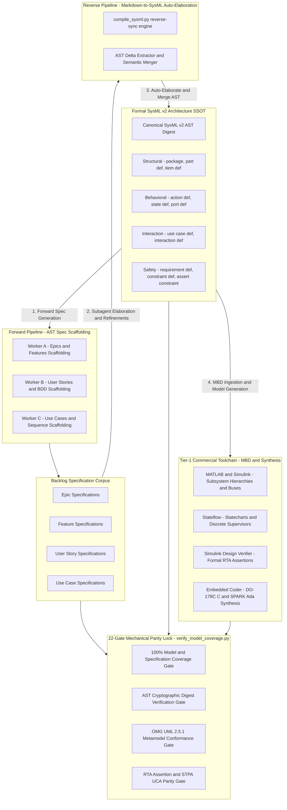
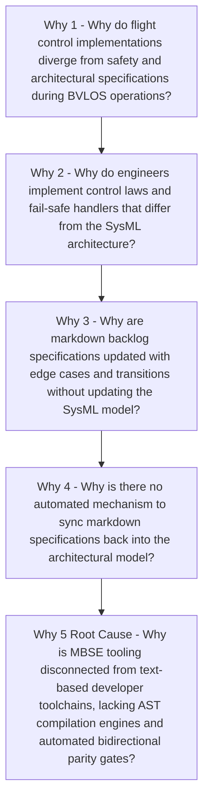
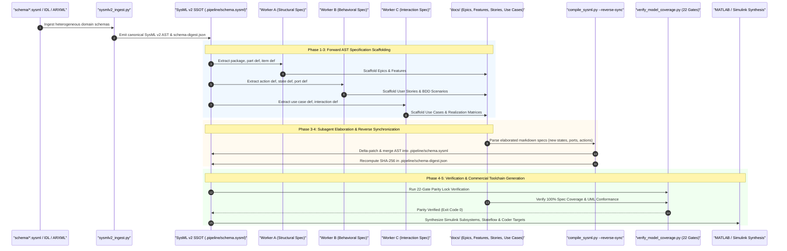
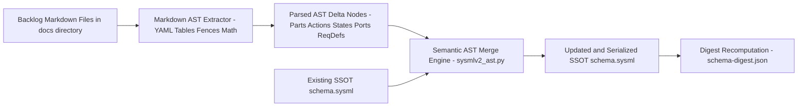
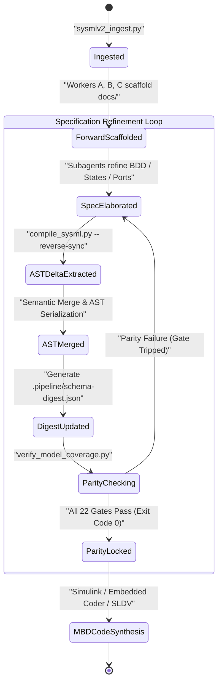
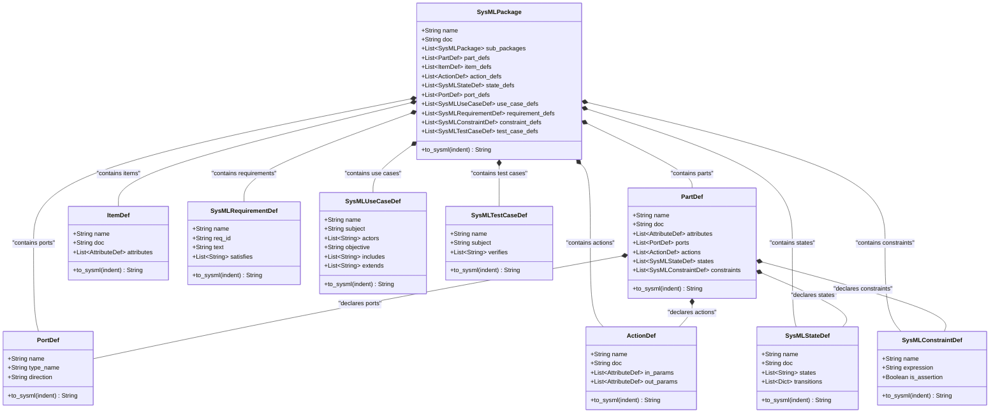
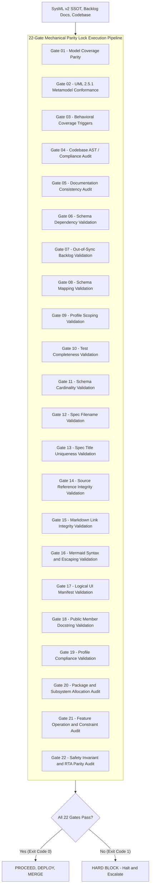
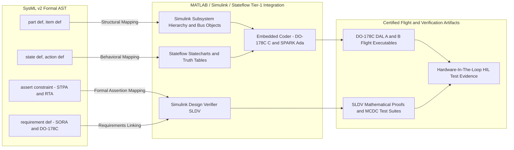

# DEAP Closed-Loop Bidirectional SysML v2 Synchronization & Zero-Drift Architecture

> **Document Identifier:** `DEAP-BLUEPRINT-SYSML-SSOT-001`  
> **Status:** `APPROVED / PRODUCTION-GRADE`  
> **Classification:** `Systems Modeling Language (SysML v2) Single Source of Truth (SSOT) Bidirectional Architecture Specification`  
> **Target Standards:** `OMG SysML v2 (OMG ptc/2023-08-01)` | `ISO/IEC/IEEE 15288:2023` | `RTCA DO-178C / DO-331 (Model-Based Development)` | `RTCA DO-365B DAA` | `RTCA DO-362A C2` | `ASTM F3269-17 RTA`

---

## Section 1: Executive Summary & The Specification-Model Drift Problem

### 1.1 Executive Summary

In high-integrity mission-critical cyber-physical systems—such as autonomous low-altitude Unmanned Aircraft Systems (UAS) operating Beyond Visual Line of Sight (BVLOS) near critical infrastructure—architectural correctness and safety assurance require absolute mathematical consistency across the entire engineering lifecycle.

Traditional Model-Based Systems Engineering (MBSE) methodologies and Agile software development workflows suffer from a fundamental, systemic flaw: **specification-model drift**. In conventional workflows, systems architects produce static architectural models in monolithic MBSE tools, while software engineering teams create agile backlog artifacts (Epics, Features, User Stories, and Use Cases) in issue trackers and markdown repositories. Over the course of rapid iteration, design refinements, edge-case handling, and safety mitigations are introduced in backlog documents or code without being reflected back into the formal system architecture. Conversely, architectural model updates fail to propagate deterministically to engineering backlogs, resulting in divergent implementations, broken safety invariants, unverified control laws, and compromised airworthiness certification evidence (RTCA DO-178C / DO-331).

The **Digital Engineering Agentic Pipeline (DEAP)** solves specification-model drift through an automated **Closed-Loop Bidirectional SysML v2 Synchronization & Zero-Drift Architecture**. By establishing the **OMG SysML v2 Abstract Syntax Tree (AST)** as the non-negotiable 100% Single Source of Truth (SSOT) and coupling it with bidirectional compilation tooling (`sysmlv2_ast.py` and `compile_sysml.py --reverse-sync`), DEAP enforces deterministic synchronization between formal SysML v2 models, Agile specification corpora, and Tier-1 commercial Model-Based Design (MBD) toolchains (**MATLAB / Simulink / Stateflow / Embedded Coder**).



---

### 1.2 Systemic Failure Modes of Traditional MBSE vs. Agile Workflows

Traditional aerospace and mission-critical systems engineering exhibits three catastrophic failure modes when attempting to reconcile MBSE with Agile software engineering:

1. **The "Model-as-Drawing" Anti-Pattern:** Systems models are treated as passive, human-read diagrams rather than machine-executable AST schemas. Engineers recreate models manually in text documents, leading to immediate semantic decay.
2. **One-Way Downstream Loss (The Forward-Only Chasm):** While initial requirements may be exported from SysML into ticket trackers, subsequent technical clarifications, state transition guard refinements, message payload mutations, and fail-safe triggers developed during implementation are documented exclusively in markdown or Jira issues. The upstream SysML model becomes obsolete within sprint cycles.
3. **Prose Ambiguity & Heuristic Ingestion:** Downstream developers interpret natural language markdown specifications heuristically, introducing subtle misunderstandings in timing requirements, numeric bounds, and safety interlocks that fail only during hardware-in-the-loop (HIL) testing or flight trials.

---

### 1.3 5-Whys Root Cause Analysis of Specification-Model Drift

To establish why specification-model drift occurs and formulate a robust engineering mitigation, DEAP applies the formal **5-Whys Root Cause Analysis**:



- **Why 1:** Flight control implementations diverge from safety and architectural specifications because developers write code based on evolving backlog tickets (Epics, Features, User Stories) rather than outdated SysML diagrams.
- **Why 2:** Backlog tickets diverge from the SysML model because developers and subagents discover unmodeled operational constraints, hardware limits, and protocol edge cases during specification refinement and implementation.
- **Why 3:** Developers update backlog markdown files without updating SysML models because traditional SysML authoring is manual, heavyweight, and siloed in proprietary GUI tools outside the git-based CI/CD pipeline.
- **Why 4:** No automated bidirectional synchronization exists because existing MBSE tools lack programmatic AST parsers and reverse-compilation engines capable of converting structured markdown specifications back into standard SysML textual constructs.
- **Why 5 (Root Cause):** The systems engineering architecture lacked a unified **bidirectional AST compiler** and a **mechanical verification gate lock** that treats SysML v2 as the canonical machine-readable SSOT while permitting seamless bidirectional markdown auto-elaboration.

---

### 1.4 The DEAP Closed-Loop Bidirectional Solution

The DEAP framework eliminates specification-model drift by establishing three architectural invariants:

1. **SysML v2 Textual AST as Universal SSOT:** The canonical system model resides in `.pipeline/schema.sysml` and is tracked as code under version control. All structural, behavioral, interface, interaction, safety, and test definitions are declared as formal AST nodes.
2. **Automated Bidirectional Compilation (`compile_sysml.py --reverse-sync`):** 
   - **Forward Compilation:** SysML v2 AST nodes deterministically scaffold initial Epics, Features, User Stories, and Use Cases with standardized metadata, BDD acceptance criteria, and UML diagrams.
   - **Reverse Compilation:** When subagents or engineers refine backlog specifications (adding new state transitions, typed ports, actions, safety constraints, or use case extensions), the reverse compilation engine parses the structured markdown, extracts AST deltas, and automatically updates `.pipeline/schema.sysml` and `.pipeline/schema-digest.json`.
3. **22-Gate Mechanical Parity Lock (`verify_model_coverage.py`):** A strict, deterministic, offline verification suite blocks any pull request or pipeline commit that exhibits even a single discrepancy between the SysML v2 AST and downstream specifications or codebase realizations.

---

## Section 2: Closed-Loop Bidirectional Synchronization Architecture

### 2.1 Architectural Overview & Data Flow Topology

The DEAP bidirectional architecture operates across two distinct phases: **Forward AST Spec Scaffolding** and **Reverse AST Markdown-to-SysML Auto-Elaboration**.



---

### 2.2 Forward Pipeline: Schema Ingestion & AST Spec Scaffolding (Pipeline 0 & 1)

1. **Heterogeneous Ingestion:** Domain schemas located in `schema/` (OMG SysML v2 `.sysml`, AUTOSAR `.arxml`, OMG IDL `.idl`, Protocol Buffers `.proto`, or OpenAPI `.yaml`) are ingested by `sysmlv2_ingest.py`.
2. **Canonical AST Translation:** Domain constructs are mapped into normalized SysML v2 AST nodes:
   - Components & Data Payloads -> `part def`, `item def`
   - Operations & Methods -> `action def`, `operation def`
   - Operational Modes & FSMs -> `state def`
   - Interfaces & Buses -> `port def`
   - Safety Constraints -> `requirement def`, `constraint def`, `assert constraint`
   - Operational Missions -> `use case def`, `interaction def`
3. **Spec Scaffolding Dispatch:** Worker subagents (Workers A, B, C) are dispatched in isolated contexts to project the AST into markdown specifications in `docs/epics/`, `docs/features/`, `docs/user-stories/`, and `docs/use-cases/`.

---

### 2.3 Reverse Pipeline: Markdown-to-SysML Auto-Elaboration (`--reverse-sync`)

When subagents or engineers elaborate specifications during design sprints, they frequently add:
- Unmodeled exception flows and fail-safe recovery branches.
- Guard predicates and hysteresis bounds on state transitions.
- Concrete port data types and communication bus bindings.
- Detailed STPA Unsafe Control Action (UCA) mitigations and ASTM F3269-17 RTA envelope constraints.
- Extended use case interaction sequences.

The Reverse Compilation Engine (`python3 scripts/compile_sysml.py --reverse-sync`) performs the following mechanical pipeline:



1. **Markdown Parsing:** Traverses `docs/epics`, `docs/features`, `docs/user-stories`, and `docs/use-cases`.
2. **AST Delta Extraction:** Extracts YAML frontmatter metadata, Mermaid class/state/use-case diagrams, Given-When-Then BDD action signatures, and STPA/FMECA markdown tables.
3. **Semantic Merging & Deduplication:** Compares extracted nodes against existing AST definitions in `.pipeline/schema.sysml`. New items are added; existing definitions are enriched with attributes, actions, states, and ports without destroying existing structural invariants.
4. **AST Serialization & Digest Update:** Serializes the merged AST back to valid SysML v2 textual syntax via `to_sysml()` and recomputes the cryptographic SHA-256 digest in `.pipeline/schema-digest.json`.

---

### 2.4 Closed-Loop Bidirectional State Machine & Synchronization Flow



---

### 2.5 AST Idempotency, Conflict Resolution, & Cryptographic Digest Parity

To ensure deterministic, reproducible builds across distributed agent clusters and CI/CD pipelines, the synchronization engine enforces three core properties:

1. **AST Idempotency:** Running `--reverse-sync` multiple times on identical markdown files produces an identical AST without token duplication or formatting drift:
   $$AST_{t+1} = \text{Merge}(AST_t, \Delta_{\text{Markdown}}) \quad \text{where} \quad \Delta_{\text{Markdown}} = \emptyset \implies AST_{t+1} \equiv AST_t$$
2. **Conflict Resolution Matrix:**
   - *Attribute Type Conflict:* SysML v2 explicit type definitions take precedence over markdown inferred types unless the markdown type is a specialization.
   - *State Transition Conflict:* Markdown-elaborated guard conditions and actions are merged additively into the parent `state def`.
   - *Port Direction Conflict:* Explicit `in`, `out`, `inout` declarations in markdown interface tables overwrite generic bidirectional defaults.
3. **Cryptographic Parity Digest:** Every synchronization step writes a canonical JSON digest to `.pipeline/schema-digest.json` containing:
   - SHA-256 checksum of `.pipeline/schema.sysml`.
   - Total count and symbol table of packages, parts, attributes, ports, actions, states, constraints, test cases, use cases, and item definitions.
   - Verification timestamp and compiler version metadata.

---

## Section 3: The Complete 6-Layer Parity Matrix & Bidirectional Mapping Invariants

The DEAP architecture defines a formal **6-Layer Parity Matrix** establishing an unbroken, bidirectional correspondence between SysML v2 AST metamodel constructs, Agile backlog specifications, and Tier-1 MBD targets.

```mermaid
flowchart LR
    subgraph Layer1 ["1. Structural Layer"]
        L1_SysML["package, part def, item def"] --- L1_Doc["Epics and Features"]
        L1_Doc --- L1_MBD["Simulink Subsystems and Bus Objects"]
    end

    subgraph Layer2 ["2. Behavioral Layer"]
        L2_SysML["action def, state def"] --- L2_Doc["User Stories and BDD Scenarios"]
        L2_Doc --- L2_MBD["Stateflow Charts and Truth Tables"]
    end

    subgraph Layer3 ["3. Interaction Layer"]
        L3_SysML["use case def, interaction def"] --- L3_Doc["Use Cases and Realization Matrix"]
        L3_Doc --- L3_MBD["Simulink Sequence Callers and Test Harnesses"]
    end

    subgraph Layer4 ["4. Interface and Port Layer"]
        L4_SysML["port def in out inout"] --- L4_Doc["Interface Specifications and Contracts"]
        L4_Doc --- L4_MBD["Simulink Inport Outport and Signal Buses"]
    end

    subgraph Layer5 ["5. Safety and Constraint Layer"]
        L5_SysML["requirement def, assert constraint"] --- L5_Doc["STPA UCAs and FMECA Safety Invariants"]
        L5_Doc --- L5_MBD["SLDV Property Specs and RTA Monitors"]
    end

    subgraph Layer6 ["6. Test and Realization Layer"]
        L6_SysML["test case def, verify, satisfy"] --- L6_Doc["Acceptance Criteria and TDD Test Suites"]
        L6_Doc --- L6_MBD["Simulink Test Assessments and HIL Benches"]
    end
```



---

### 3.1 Layer 1: Structural Architecture Layer

- **SysML v2 Constructs:** `package`, `part def`, `item def`, `attribute def`.
- **Backlog Representation:** `docs/epics/*.md` (subsystem packages), `docs/features/*.md` (part definitions and item definitions).
- **MBD Mapping:** Simulink Model Reference blocks, Subsystems, `Simulink.Bus` definitions.
- **Invariants:**
  - Every Epic maps to exactly one top-level architectural `package`.
  - Every Feature maps 1:1 to a `part def` (physical/logical component) or `item def` (data payload).
  - Attributes declared on a `part def` must match the Feature's Mermaid Class Diagram attributes with exact typing.

### 3.2 Layer 2: Behavioral & Dynamic State Layer

- **SysML v2 Constructs:** `action def`, `state def`, entry/exit actions, transition guards.
- **Backlog Representation:** `docs/user-stories/*.md`, Given-When-Then BDD acceptance criteria, state transition tables.
- **MBD Mapping:** Stateflow State Transition Diagrams, Discrete-Event Controllers, MATLAB Function blocks.
- **Invariants:**
  - Every User Story maps to an `action def` (algorithmic operation) or a `state def` (operational mode).
  - Given-When-Then BDD scenarios execute against the actions, inputs (`in`), outputs (`out`), and state guards of the parent `part def`.
  - State transitions in markdown state diagrams must be represented as valid transitions within the parent SysML `state def`.

### 3.3 Layer 3: System Interaction & Operational Layer

- **SysML v2 Constructs:** `use case def`, `subject`, `actor`, `objective`, `include`, `extend`, `interaction def`.
- **Backlog Representation:** `docs/use-cases/*.md`, Use Case Realization Matrices, sequence diagrams.
- **MBD Mapping:** Simulink Test Sequence blocks, System-level Scenario Harnesses.
- **Invariants:**
  - Every Use Case specification maps to a formal `use case def`.
  - Must declare `subject` (`part def` providing capability), `actor` ports, and `objective`.
  - Include and extend dependencies must correspond to formal `include use case` and `extend use case` relationships in SysML.

### 3.4 Layer 4: Interface & Communication Layer

- **SysML v2 Constructs:** `port def`, flow directions (`in`, `out`, `inout`), typed data payload bindings.
- **Backlog Representation:** Feature `Interface Requirements` tables, logical port schemas.
- **MBD Mapping:** Simulink `Inport` / `Outport` blocks, Typed Bus Ports, AUTOSAR Port Interfaces.
- **Invariants:**
  - All communication boundaries between parts must be routed via strongly-typed `port def` declarations.
  - Directionality must be explicit (`in`, `out`, `inout`).

### 3.5 Layer 5: Safety, Hazard & Constraint Layer

- **SysML v2 Constructs:** `requirement def`, `constraint def`, `assert constraint`, `assume`, `require`.
- **Backlog Representation:** STPA Unsafe Control Actions (UCAs), FMECA failure tables, ASTM F3269-17 Run-Time Assurance (RTA) invariants.
- **MBD Mapping:** Simulink Design Verifier (SLDV) `sldv.assert` and `sldv.assume` blocks, RTA Envelope Monitor blocks.
- **Invariants:**
  - All safety constraints derived from STPA/FMECA must be declared as formal `assert constraint` or `requirement def` nodes.
  - Constraint expressions must be mathematically formulated (e.g. `lossDuration <= 2.0 and magneticFluxNorm <= 250.0`).

### 3.6 Layer 6: Test Case, Verification & Traceability Layer

- **SysML v2 Constructs:** `test case def`, `verify requirement`, `satisfy requirement`.
- **Backlog Representation:** TDD test suites, verification plans, bidirectional traceability tags (`/// Safety-Realises:`).
- **MBD Mapping:** Simulink Test Test Harnesses, Coverage Assessments (100% MC/DC).
- **Invariants:**
  - Every acceptance criterion maps to a `test case def` with an explicit `verify` relationship to its parent `requirement def` or `action def`.

---

### 3.7 Complete 6-Layer Formal Parity Matrix Table

| Layer | SysML v2 AST Metamodel Construct | Backlog Specification Artifact | Tier-1 MBD Target (Simulink/Stateflow/Coder) | Bidirectional Mapping Invariant |
| :--- | :--- | :--- | :--- | :--- |
| **1. Structural** | `package`<br>`part def`<br>`item def`<br>`attribute def` | `docs/epics/*.md`<br>`docs/features/*.md`<br>Class Diagrams | Simulink Subsystems<br>Model References<br>`Simulink.Bus`<br>Data Dictionaries | 1:1 Package-to-Epic mapping. Every Feature is a `part def`/`item def`. Attributes typed and matched. |
| **2. Behavioral** | `action def`<br>`state def`<br>Transitions<br>Guards | `docs/user-stories/*.md`<br>BDD Scenarios<br>State Diagrams | Stateflow Statecharts<br>Truth Tables<br>MATLAB Functions | Every Story maps to `action def` or `state def`. BDD steps map to in/out action params. |
| **3. Interaction** | `use case def`<br>`subject`<br>`actor`<br>`interaction def` | `docs/use-cases/*.md`<br>Realization Matrix<br>Sequence Diagrams | Test Sequence Blocks<br>Scenario Generators<br>Mission Supervisors | Formal `subject` (`part def`), typed `actor` ports, explicit `include`/`extend` trees. |
| **4. Interface** | `port def`<br>`in / out / inout`<br>Payload types | Feature Interface Tables<br>Data Contracts<br>Sequence Lifelines | Inports / Outports<br>Bus Element Ports<br>AUTOSAR Interfaces | Strongly-typed directional ports. Flow payloads bound to `item def` schemas. |
| **5. Safety** | `requirement def`<br>`constraint def`<br>`assert constraint` | STPA UCAs<br>FMECA Modes<br>RTA Geofence Invariants | SLDV Property Specs<br>`sldv.assert`<br>RTA Guard Monitors | Formally parsed mathematical expressions (`<=`, `&&`). 100% trace from SORA/STPA to SysML. |
| **6. Verification**| `test case def`<br>`verify`<br>`satisfy` | TDD Unit/Property Tests<br>Acceptance Test Plans<br>`/// Safety-Realises:` | Simulink Test Files<br>MC/DC Coverage Suites<br>Polyspace Asserts | Every requirement verified by at least one `test case def`. 100% closed digital thread. |

---

## Section 4: Automated AST Compilation Engine (`sysmlv2_ast.py` & `compile_sysml.py --reverse-sync`)

### 4.1 Canonical AST Metamodel & Python Class Hierarchy

The DEAP SysML v2 compilation framework is implemented in `skills/spec-orchestrator/scripts/sysmlv2_ast.py` and `scripts/compile_sysml.py`. It defines a complete object-oriented AST representation:



---

### 4.2 Forward AST Generation & Textual SysML v2 Emission (`to_sysml()`)

Every AST node implements the `to_sysml(indent: int) -> str` method, producing compliant OMG SysML v2 textual notation:

```sysml
package LowAltitudeUAS_InfrastructureSafety {
    doc /* Low-Altitude UAS Infrastructure Safety Architecture SSOT */

    item def TelemetryFramePayload {
        attribute timestamp_ns : Integer;
        attribute latitude_deg : Real;
        attribute longitude_deg : Real;
        attribute altitude_agl_m : Real;
        attribute magnetic_flux_ut : Real;
    }

    part def FlightSafetySupervisor {
        doc /* Real-Time Flight Safety and RTA Geofence Supervisor */

        in port telemetryIn : TelemetryFramePayload;
        out port safetyCommandOut : FlightControlCommand;

        action evaluateGeofenceBoundary(in telemetry : TelemetryFramePayload, out breachPredicted : Boolean);
        action triggerFailSafeRTL(in triggerReason : String, out commandedMode : FlightMode);

        state def OperationalState {
            state NominalFlight;
            state SafeHoverHolding;
            state AutomatedRTL;
            state EmergencyGlideLanding;

            transition NominalFlight to SafeHoverHolding
                accept evaluateGeofenceBoundary
                if breachPredicted == true;

            transition SafeHoverHolding to AutomatedRTL
                accept triggerFailSafeRTL
                if c2LinkLost == true;
        }

        assert constraint Assert_RTA_GeofenceContainment {
            geofenceBoundaryDistance >= 5.0;
        }

        assert constraint Assert_EMF_MagnetometerSaturation {
            magneticFluxNorm <= 250.0;
        }
    }

    use case def RealizeEmergencyContainment {
        subject FlightSafetySupervisor;
        actor GCS_Operator;
        actor DAA_SensorArray;
        objective /* Execute immediate containment maneuver upon boundary breach or C2 loss */;
    }
}
```

---

### 4.3 Reverse AST Parser & Markdown Specification Extractor

The reverse compilation pipeline in `scripts/compile_sysml.py --reverse-sync` operates through specialized extraction sub-routines:

1. **YAML Frontmatter Extractor:** Extracts item identifiers (`epic_id`, `feature_id`, `story_id`, `use_case_id`), target subsystems, titles, and `generation_mode: "subagent"`.
2. **Mermaid Class Diagram Parser:** Parses class names, member attributes, type declarations, and relationships (`*--`, `-->`), mapping them to `part def`, `item def`, and `attribute def`.
3. **Mermaid State Diagram Parser:** Extracts state nodes, mode hierarchies, transitions (`StateA --> StateB`), events, and guarded actions (`[guard] / action`), mapping them to `SysMLStateDef`.
4. **BDD Action Extractor:** Scans Given-When-Then blocks in User Stories, deriving computational inputs, preconditions, and postconditions into `ActionDef` signatures with typed `in`/`out` parameters.
5. **STPA/FMECA Table Parser:** Parses Markdown hazard matrices and extracts Unsafe Control Actions (UCAs) and failure modes, synthesizing mathematical `SysMLConstraintDef` and `assert constraint` nodes.
6. **Use Case Matrix Extractor:** Parses Actor, Subject, Precondition, and Trigger tables in Use Case specifications, compiling them into `SysMLUseCaseDef` with explicit `include` and `extend` links.

---

### 4.4 Semantic Delta-Patching, Deduplication, & AST Merge Engine

The merge engine prevents duplication and maintains non-destructive delta-patching:
- **Identifier Normalization:** Sanitizes IDs to standard alphanumeric identifiers (e.g. `UCA-UAS-01` -> `Assert_UCA_UAS_01`).
- **Deep Component Merging:** When a Feature adds a new action or port to an existing `part def`, the merger updates the component in place rather than instantiating a duplicate part.
- **Invariant Preservation:** Existing formal constraints and mathematical expressions in `.pipeline/schema.sysml` cannot be overwritten by empty or incomplete markdown drafts.

---

### 4.5 Automated CLI Invocation Standards

```bash
# Standard Reverse Synchronization: Sync all markdown specs into SysML SSOT
python3 scripts/compile_sysml.py --reverse-sync

# Targeted Spec Directory Reverse Sync
python3 scripts/compile_sysml.py --reverse-sync \
  --docs-dir docs \
  --output .pipeline/schema.sysml \
  --digest .pipeline/schema-digest.json

# STPA Hazard Analysis Compilation to SysML Constraints
python3 scripts/compile_sysml.py --stpa docs/safety/stpa_hazard_matrix.md
```

---

## Section 5: Mechanical Verification & 22-Gate Parity Lock (`verify_model_coverage.py`)

### 5.1 Verification Architecture & Zero-Tolerance Philosophy

DEAP enforces a **Zero-Tolerance Mechanical Verification Lock**. Verification is executed offline by `skills/spec-orchestrator/scripts/verify_model_coverage.py` (powered by the `parity_auditor` engine).

No code commit, pull request, or pipeline promotion is permitted unless all **22 Verification Gates** pass with exit code 0. In accordance with `.pipeline/constitution.md`, mock CLI tools, heuristic bypasses, and network egress are strictly prohibited during gate execution.



---

### 5.2 Systematic Catalog of the 22 Parity Verification Gates

| Gate ID | Gate Name | Subsystem / Checker | Mechanical Verification Rule |
| :--- | :--- | :--- | :--- |
| **Gate 01** | Model Coverage Parity | `UmlValidator` | 100% of SysML v2 `part def` and `item def` nodes must be covered in Feature class diagrams. |
| **Gate 02** | UML 2.5.1 Metamodel Conformance | `UmlValidator` | Prohibits isolated classes, unstereotyped links, unquoted relationship labels, and syntax defects. |
| **Gate 03** | Behavioral Coverage Triggers | `BehavioralValidator` | Every state transition and action must have an associated BDD trigger scenario. |
| **Gate 04** | Codebase AST / Compliance | `CodebaseValidator` | Verifies source code realization, write-lock controls, and zero dynamic heap allocation in flight loops. |
| **Gate 05** | Documentation Consistency | `DocsValidator` | Verifies structural completeness of Epics, Features, User Stories, and Use Cases. |
| **Gate 06** | Schema Dependency Validation | `DependencyValidator` | Verifies acyclic dependency graphs and valid cross-feature references. |
| **Gate 07** | Out-of-Sync Backlog Validation | `SyncValidator` | Reconciles GitHub issue state against local markdown files, detecting unsynced issues. |
| **Gate 08** | Schema Mapping Validation | `SchemaMappingValidator` | Confirms every SysML element traces to downstream markdown specifications. |
| **Gate 09** | Profile Scoping Validation | `ProfileScopingValidator` | Enforces domain-specific constraints defined in `.pipeline/profiles/*.md`. |
| **Gate 10** | Test Completeness Validation | `TestCompletenessValidator`| Ensures every Feature and User Story has corresponding automated test specifications. |
| **Gate 11** | Schema Cardinality Validation | `SchemaCardinalityValidator`| Enforces strict 1:1 container-to-file cardinality rules. |
| **Gate 12** | Spec Filename Validation | `SpecFilenameValidator` | Enforces naming conventions (`epic-*.md`, `feat-*.md`, `story-*.md`, `uc-*.md`). |
| **Gate 13** | Spec Title Uniqueness | `SpecTitleUniquenessValidator`| Guarantees specification title uniqueness across subagent-generated markdown files. |
| **Gate 14** | Source Reference Integrity | `SourceReferenceValidator` | Verifies authoritative upstream URLs are preserved verbatim without local self-referencing. |
| **Gate 15** | Markdown Link Integrity | `LinkValidator` | Offline verification that 100% of markdown hyperlinks resolve to existing files. |
| **Gate 16** | Mermaid Syntax & Escaping | `MermaidSyntaxValidator` | Validates Mermaid headers, quotes, escaping, and ensures no colons in class members/labels. |
| **Gate 17** | Logical UI Manifest Validation| `LogicalUiValidator` | Validates `logical-layout.json` manifest parsing, container hierarchy, and tabular children. |
| **Gate 18** | Docstring Validation | `DocstringValidator` | Verifies docstring parity across all public interface methods and classes. |
| **Gate 19** | Profile Compliance Validation | `ProfileComplianceValidator` | Verifies strict compliance with DO-178C, DO-331, or AUTOSAR profiles. |
| **Gate 20** | Package & Subsystem Allocation | `aggregator.py` | Validates subsystem capability allocation and boundary consistency. |
| **Gate 21** | Feature Operation & Constraint| `aggregator.py` | Verifies feature operation signatures and schema constraint mappings. |
| **Gate 22** | Safety Invariant & RTA Parity | `compile_sysml.py` | Confirms 100% of STPA UCAs, FMECA modes, and RTA geofence assertions compile into SysML AST. |

---

### 5.3 Offline Execution, Subagent Isolation, & Zero-Mocking Enforcement

- **Subagent Isolation Verification (`generation_mode: "subagent"`):** Every generated specification must include `generation_mode: "subagent"` in its YAML frontmatter. Gate 01 rejects any artifact generated directly in the coordinator context.
- **Offline Integrity:** All 22 gates execute completely offline without network calls, preventing CI flake and guaranteeing air-gapped security.
- **Zero-Mocking Lock:** The validator actively scans for mock binaries in `scratch/bin/` (`gh`, `git`) and aborts with a fatal error if mock wrappers are detected.

---

## Section 6: Primary Commercial Toolchain Integration (MATLAB / Simulink / Stateflow / Embedded Coder / SLDV)

### 6.1 Commercial Toolchain Ecosystem & MBSE Bridging Strategy

DEAP explicitly declares **MATLAB / Simulink / Stateflow / Embedded Coder** as its **Primary Tier-1 Commercial Toolchain Integration Context**.

The SysML v2 AST serves as the formal digital bridge to MathWorks Model-Based Design (MBD) tools, enabling automated synthesis of plant models, flight control laws, discrete statecharts, formal verification proofs, and DO-178C / DO-331 qualified source code.



---

### 6.2 Structural Block Diagram Mapping: SysML `part def` -> Simulink Subsystem Hierarchy

1. **Subsystem Hierarchy:** Every SysML v2 `part def` maps directly to a Simulink Subsystem block or Model Reference (`.slx`).
2. **Bus Objects:** Every SysML `item def` generates a corresponding `Simulink.Bus` object in the MATLAB Base Workspace / Data Dictionary (`.sldd`), ensuring typed bus communication across Simulink ports.
3. **Port Interfaces:** Directional `port def` elements (`in`, `out`) generate typed `Inport` and `Outport` blocks configured with matching `Simulink.Bus` contracts.

---

### 6.3 Behavioral Control Law Synthesis: SysML `state def` & `action def` -> Stateflow Statecharts

1. **State Transition Diagrams:** SysML `state def` blocks (e.g. `OperationalState`, `FailSafeState`) drive Stateflow chart synthesis. Each SysML state becomes a Stateflow state, and each transition with its guard condition (`[guard]`) and action (`/ action`) maps directly to Stateflow transition logic.
2. **Action Sequences:** SysML `action def` nodes map to Stateflow Truth Tables or MATLAB Function blocks implementing deterministic, discrete-event supervisory logic.
3. **Mode Management:** Fail-safe mode transitions (e.g. `NominalFlight -> SafeHoverHolding -> AutomatedRTL`) execute deterministically within Stateflow discrete supervisors.

---

### 6.4 Safety-Critical Code Synthesis: Typed SysML Contracts -> Embedded Coder DO-178C C / SPARK Ada

1. **Code Generation Pipeline:** Simulink models and Stateflow statecharts synthesized from SysML v2 feed **Embedded Coder** to generate MISRA C:2012 / DO-178C DAL A/B compliant C code or SPARK Ada formally proven source code.
2. **Deterministic Memory & Zero Heap:** In alignment with DEAP safety constraints, Embedded Coder is configured with static memory allocation profiles (zero dynamic heap allocation, zero pointer aliasing).
3. **Traceability Annotations:** Generated C/Ada source code preserves SysML traceability tags:
   ```c
   /*
    * SysML v2 Traceability:
    * PartDef: LowAltitudeUAS::FlightSafetySupervisor
    * ActionDef: evaluateGeofenceBoundary
    * RequirementDef: REQ_UAS_RTA_001 (ASTM F3269-17)
    */
   void FlightSafetySupervisor_step(void) {
       /* Evaluate Run-Time Assurance Geofence Containment Boundary */
       if (rtU.telemetryIn.altitude_agl_m < 20.0f && rtU.telemetryIn.descent_rate > 3.0f) {
           rtY.safetyCommandOut.commandedMode = Mode_AutomatedRTL;
       }
   }
   ```

---

### 6.5 Formal Property Verification & Run-Time Assurance: SysML `assert constraint` -> SLDV

1. **SLDV Property Specification:** SysML v2 `assert constraint` nodes compiled from STPA UCAs and FMECA failure modes are transformed into **Simulink Design Verifier (SLDV)** property specification blocks (`sldv.assert`, `sldv.assume`).
2. **Mathematical Proofs:** SLDV runs formal property proving algorithms (Prover engine) to mathematically prove that the Stateflow supervisory logic cannot violate the safety invariants under any valid input trajectory:
   $$\forall t \ge 0, \quad \text{c2LinkLost}(t) \land (\text{lossDuration}(t) > 2.0\,\text{s}) \implies \text{rtlActive}(t) == \text{true}$$
3. **ASTM F3269-17 Run-Time Assurance Monitor:** Proved safety monitors are compiled into independent, high-integrity RTA guard wrappers that supervise complex primary autopilot control laws, executing immediate containment fallback upon any envelope breach.

---

### 6.6 End-to-End Traceability & Unbroken Digital Thread Matrix

The DEAP closed-loop architecture establishes an unbroken digital thread spanning standards, models, specifications, code, and test evidence:

```mermaid
flowchart LR
    subgraph Regulatory ["1. Regulatory Standards"]
        SORA["JARUS SORA v2.5 SAIL I-VI"]
        ASTM["ASTM F3269-17 RTA"]
        DO178["RTCA DO-178C and DO-331"]
    end

    subgraph Architecture ["2. SysML v2 SSOT"]
        SysML_Pkg["SysML Model SSOT - schema.sysml"]
        AST_Digest["AST Digest - schema-digest.json"]
    end

    subgraph Specifications ["3. Backlog Specs"]
        Epics["Epic Specifications"]
        Features["Feature Specifications"]
        Stories["User Story Specifications"]
        UseCases["Use Case Specifications"]
    end

    subgraph Toolchain ["4. Tier-1 Commercial Toolchain"]
        Simulink_MBD["Simulink Subsystems"]
        Stateflow_FSM["Stateflow Statecharts"]
        SLDV_Proofs["SLDV Formal Properties"]
        Coder_C["Embedded Coder C and SPARK Ada"]
    end

    subgraph Verification ["5. Verification and Flight Evidence"]
        Parity_Lock["22-Gate Parity Lock"]
        HIL_Testing["HIL Test Runs and MCDC Reports"]
        Airworthiness["Airworthiness Certification Evidence"]
    end

    Regulatory --> Architecture
    Architecture ---|"Bidirectional Sync"| Specifications
    Architecture --> Toolchain
    Specifications --> Parity_Lock
    Architecture --> Parity_Lock
    Toolchain --> Verification
    Parity_Lock --> Verification
```



Through this unbroken digital thread, any modification at any layer—whether in high-level SORA parameters, SysML v2 architectural definitions, backlog markdown specifications, or Simulink control models—is mechanically synchronized, formally verified, and cryptographically locked, eliminating specification drift and guaranteeing certifiable safety for autonomous low-altitude UAS operations.
