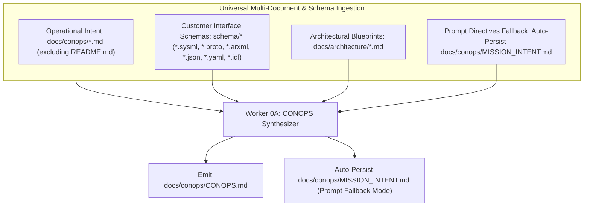

# Concept of Operations (CONOPS) Directory

This directory contains high-level operational concepts, customer mission intent specifications (`MISSION_INTENT.md` or multi-document intent specifications `*.md`), and synthesized Concept of Operations models (`CONOPS.md`) for the Digital Engineering Agent Platform (DEAP).

## Purpose & Scope

The `docs/conops/` directory is the entry point for systems engineering and safety lifecycle workflows in Pipeline 0 (**Pre-Spec Safety Engineering Engine**). It establishes the operational baseline, mission flight envelopes, airspace constraints, stakeholder responsibilities, and operational phase state machines prior to hazard analysis and architectural modeling.

## Upstream Clean Landing Zone Invariant

In upstream distribution templates (`DEAP-*`), the `docs/conops/` directory is strictly maintained as a **clean landing zone** containing only `.gitkeep` and `README.md`. Concrete customer mission intent specifications (`MISSION_INTENT.md`) and synthesized operational concepts (`CONOPS.md`) are never committed to upstream templates; they reside exclusively in downstream application workspaces initialized via `scripts/install_pipeline.sh`.

## Primary Commercial Toolchain Integration Context

This project explicitly declares **MATLAB / Simulink / Stateflow / Embedded Coder** as the Primary Tier-1 Commercial Toolchain Integration Context (Model-Based Design, Control Law Synthesis, DO-178C C/SPARK Ada code generation). Operational flight envelopes, dynamic performance boundaries, and phase switching logic synthesized in `CONOPS.md` provide the baseline requirements for Stateflow mode managers and Simulink flight dynamics models.

---

## Universal Multi-Document & Schema Ingestion Contract

Pipeline 0 Worker 0A (**CONOPS & Mission Scenario Synthesizer**) executes **Universal Multi-Document & Schema Ingestion** across operational intent specifications, customer interface schemas, and architectural blueprints:



### Multi-Document Discovery & Ingestion Guidelines
1. **Operational Intent Discovery (`docs/conops/*.md`)**: Worker 0A scans `docs/conops/` for all mission intent markdown files (`*.md`, excluding `README.md`). If present, all discovered documents are ingested as authoritative operational specifications. When `docs/conops/` contains no intent files, Worker 0A ingests prompt directives and auto-persists `docs/conops/MISSION_INTENT.md` adhering to the canonical schema.
2. **Customer Interface & Model Schemas (`schema/*`)**: Worker 0A scans `schema/` for pre-existing customer models and interface definitions (`*.sysml`, `*.proto`, `*.arxml`, `*.json`, `*.yaml`, `*.idl`). Discovered port definitions, telemetry streams, message structures, and subsystem boundaries are ingested to inform functional and physical boundaries in `CONOPS.md`.
3. **Architectural Blueprint Ingestion (`docs/architecture/*.md`)**: Worker 0A scans `docs/architecture/` (and `docs/architecture/blueprints/`) for existing architectural specifications, network blueprints, and safety frameworks (`*.md`), reconciling system boundaries with MATLAB / Simulink / Stateflow control law synthesis hooks.
4. **Prompt Fallback with Auto-Persisting**: When no intent markdown files exist in `docs/conops/`, Worker 0A ingests raw natural language parameters and operational directives from the execution prompt. To maintain provenance and semantic traceability under version control, Worker 0A automatically generates and persists `docs/conops/MISSION_INTENT.md` capturing and standardizing the customer's input parameters according to the canonical schema.

---

## `MISSION_INTENT.md` Specification Schema

Downstream customer mission specifications placed in `docs/conops/MISSION_INTENT.md` should adhere to the following canonical markdown schema:

```markdown
# Mission Intent Specification: [Mission Title]

> **Identifier:** `MISSION-INTENT-[PROJECT-ID]-001`  
> **Classification:** `Safety-Critical Low-Altitude UAS Infrastructure Operation`  
> **Target Regulatory Frameworks:** `JARUS SORA v2.5 (SAIL I–VI)` | `ASTM F3269-17 RTA` | `ASTM F3411-22a Remote ID` | `RTCA DO-365B DAA`  
> **Customer / Organization:** `[Customer Name / Program Office]`  
> **Version:** `1.0.0`  
> **Date:** `[YYYY-MM-DD]`  

---

## 1. Mission Statement & Operational Objectives
- **Mission Purpose:** High-level narrative of the intended UAS flight operation (e.g. BVLOS critical utility corridor inspection, urban medical delivery, perimeter surveillance).
- **Key Operational Objectives (KOOs):**
  - `KOO-01`: Primary objective and success threshold.
  - `KOO-02`: Secondary operational requirement and sensor throughput.
  - `KOO-03`: Turnaround and mission cadence constraints.

---

## 2. Operational Flight Envelope & Environmental Boundaries
- **Flight Altitude Envelope:**
  - Minimum Operating Altitude: $h_{\min} = 30\,\text{m}$ AGL
  - Nominal Inspection Altitude: $h_{\text{nom}} = 60\,\text{m}$ AGL
  - Maximum Operating Ceiling: $h_{\max} = 120\,\text{m}$ AGL ($400\,\text{ft}$)
- **Speed & Dynamics:**
  - Maximum Ground Speed: $v_{\text{gnd},\max} = 20\,\text{m/s}$
  - Nominal Survey Speed: $v_{\text{survey}} = 12\,\text{m/s}$
  - Maximum Climb / Descent Rate: $\dot{z}_{\max} = 3.0\,\text{m/s}$
- **Environmental & Meteorological Limits:**
  - Maximum Sustained Wind Speed: $v_{\text{wind},\max} = 12\,\text{m/s}$ ($24\,\text{kts}$)
  - Maximum Wind Gust: $v_{\text{gust},\max} = 15\,\text{m/s}$ ($30\,\text{kts}$)
  - Temperature Range: $-10^\circ\text{C}$ to $+45^\circ\text{C}$
  - Visibility: Minimum $5000\,\text{m}$, Day / Night VMC operations.

---

## 3. Airspace Classification & Geofencing Constraints
- **Airspace Class:** Class G uncontrolled airspace with adjacent Class D buffer zones.
- **Visual Line of Sight (VLOS) vs. BVLOS:** Beyond Visual Line of Sight (BVLOS) with designated visual observers and Remote ID broadcast.
- **Population Density & Ground Risk:** Sparse to controlled low-density ground population ($< 10\,\text{persons/km}^2$).
- **Geofencing & Containment:** 
  - Lateral Buffer: $50\,\text{m}$ containment margin.
  - Vertical Buffer: $20\,\text{m}$ ceiling buffer.
  - Geofence Breach Action: Immediate Run-Time Assurance (RTA) deceleration and automated Return-to-Launch (RTL).

---

## 4. Aircraft & Payload Specification
- **Airframe Type:** Multi-Rotor / VTOL Fixed-Wing Hybrid (17.0 kg MTOW (JARUS SORA SAIL II MTOM Envelope)).
- **Propulsion & Energy:** Electric Quad-Rotor / Octocopter with dual redundant LiPo battery packs.
- **Avionics & Compute Target:** Pixhawk / PX4 Autopilot flight controller interfaced via microRTPS/XRCE-DDS to ROS2 C++ Companion Computer.
- **Safety Critical Subsystems:**
  - Run-Time Assurance (RTA) Safety Net Monitor (ASTM F3269-17).
  - Detect and Avoid (DAA) Radar / Vision Sensor Suite (RTCA DO-365B).
  - Broadcast Remote ID Transmitter (ASTM F3411-22a).
  - Autonomous Parachute Recovery / Flight Termination System (FTS).

---

## 5. Stakeholder Roles & Command Hierarchy
- **Remote Pilot in Command (RPIC):** Ultimate authority for flight safety, pre-flight authorization, and manual emergency handover.
- **Mission Commander / Fleet Operator:** Oversees autonomous path execution, UTM mission planning, and airspace clearance.
- **UTM / Air Traffic Service Interface:** Automated machine-to-machine telemetry exchange and cooperative airspace deconfliction.

---

## 6. Flight Operational Phases & Contingencies
1. **Pre-Flight Checkout:** Automated sensor calibration, geofence upload, RTA heartbeat check.
2. **Launch & Takeoff:** Autonomous vertical climb to $30\,\text{m}$ AGL transition altitude.
3. **En-Route Cruise:** Autonomous waypoint navigation with continuous DAA scanning.
4. **Mission Execution:** Low-altitude infrastructure inspection along designated survey corridors.
5. **Approach & Landing:** Autonomous precision approach to designated landing pad.
6. **Contingency Modes:**
   - C-01 (Data Link Loss): Enter loiter for 30s; if unrecovered, execute automated fail-safe RTL.
   - C-02 (RTA Geofence Breach): Safety net intervention overrides autopilot and commands containment hold.
   - C-03 (Critical Battery / Low Power): Execute immediate emergency precision descent to nearest emergency landing zone.
```

---

## KaTeX / LaTeX Mathematical Formatting Mandate

All markdown documents in this directory MUST strictly conform to KaTeX / LaTeX mathematical rendering requirements:
- Multi-line aligned equations MUST be enclosed in `\begin{aligned} ... \end{aligned}` within double-dollar delimiters on dedicated lines.
- Bare alignment tabs `&` outside an alignment environment (`aligned`, `matrix`, `cases`) and `\begin{align*}` environments are strictly forbidden.
- Inline math expressions MUST be enclosed in single `$ ... $` delimiters.
