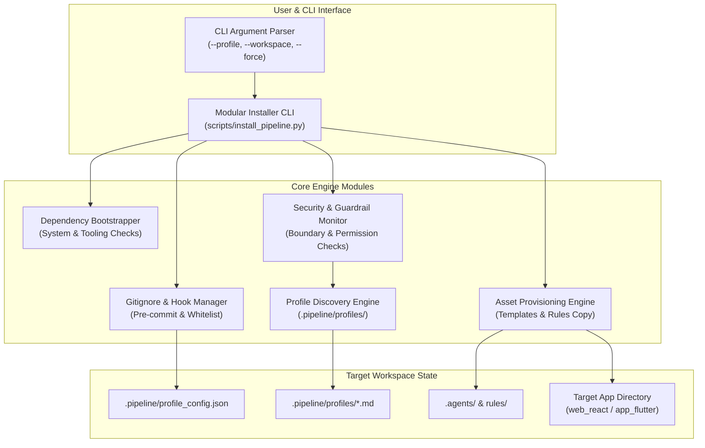
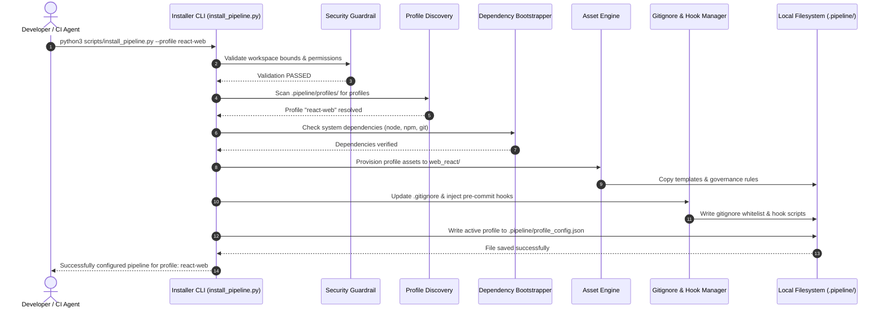
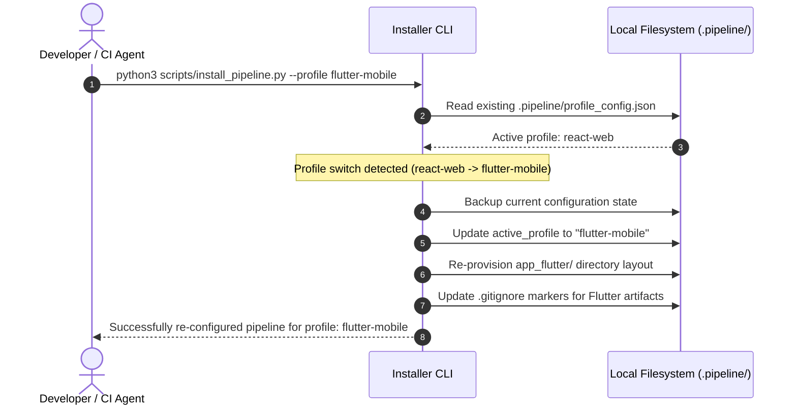

# Solution Architecture: DEAP Modular Installer CLI

**Document ID**: ARCH-DES-2026-DEAP-INST  
**Date**: August 2026  
**Status**: APPROVED / PUBLICATION-GRADE  
**Author**: DeepMind Advanced Agentic Coding Team  
**Target File**: `docs/designs/deap-installer-cli-solution.md`  
**Core Implementation**: `scripts/install_pipeline.py`  

---

## 1. Overview

The **Digital Ecosystem Architecture Pipeline (DEAP)** Modular Installer CLI is the foundational provisioning engine designed to bootstrap, configure, and harmonize downstream project repositories. As multi-platform and multi-language development environments evolve, maintaining zero-divergence architecture across React Web, Flutter Mobile, Backend API, and VHDL Hardware projects becomes paramount.

The DEAP Modular Installer CLI (`scripts/install_pipeline.py`) acts as the single entry point for environment initialization. It dynamically inspects implementation profiles stored in `.pipeline/profiles/`, validates system dependencies, copies platform-specific scaffolding assets, injects pre-commit and environment execution hooks, updates `.gitignore` whitelists with surgical precision, and records active configuration state in `.pipeline/profile_config.json`.

> [!NOTE]
> The Modular Installer CLI is designed for idempotent execution. Running the installer multiple times or switching active profiles will safely re-configure the workspace without overwriting customized user source code or introducing uncommitted pipeline drift.

---

## 2. Architectural Objectives

The design of the DEAP Modular Installer CLI is governed by four core architectural pillars:

1. **Zero-Divergence Downstream Provisioning**: Guarantee that every project instantiated using DEAP strictly inherits constitutional governance rules (`.pipeline/constitution.md`), agent guidelines (`.agents/AGENTS.md`), and platform-specific profile capabilities.
2. **Dynamic Profile Discovery & Decoupling**: Isolate platform-specific setup logic into declarative profile manifests within `.pipeline/profiles/`. The core installer CLI (`scripts/install_pipeline.py`) remains agnostic of specific frameworks, delegating asset templates, validation routines, and runtime rules to discovered profiles.
3. **Idempotency & Clean Rollback Engine**: Ensure all file operations, dependency checks, and configuration updates are transactional. If provisioning fails midway or is re-run with `--force`, the installer cleans up partial state and leaves the repository in a predictable, stable state.
4. **Strict Security & Scope Whitelisting**: Enforce workspace boundary checks (blocking any writes outside `/Users/perkunas/jail/digital-pipeline-repo`), sanitize external command inputs, and automatically maintain `.gitignore` whitelists so critical pipeline metadata is tracked while build artifacts remain excluded.

> [!IMPORTANT]
> The installer enforces strict workspace boundaries. Any attempt to write files or execute commands outside the repository root is automatically intercepted and halted by the security guardrail sub-routine.

---

## 3. System Architecture & Component Diagram

The installer CLI is structured around a decoupled modular architecture. The following Mermaid diagram illustrates the core components, their structural relationships, and data flow during execution.



---

## 4. Modular Installer CLI Deep-Dive (`scripts/install_pipeline.py`)

The installer CLI (`scripts/install_pipeline.py`) manages the lifecycle of downstream repository configuration. This section breaks down its key subsystems and operational mechanics.

### 4.1. Profile Discovery Mechanism

Profiles represent tailored target platforms supported by the pipeline. Rather than hardcoding supported target profiles directly into Python code, `install_pipeline.py` implements a dynamic **Profile Discovery Mechanism**:

* **Discovery Location**: `.pipeline/profiles/` directory.
* **Supported Profiles**:
  * `react-web`: React 18+ Web Single-Page Application (SPA) architecture (`web_react/`).
  * `flutter-mobile`: Flutter Cross-Platform Desktop/Mobile architecture (`app_flutter/`).
  * `backend-api`: Decoupled microservice REST/gNMI backend API profile.
  * `vhdl-hardware`: Telecommunications hardware simulation & synthesis profile.
* **Discovery Flow**:
  1. Scan `.pipeline/profiles/` for profile specification documents and JSON manifests.
  2. Parse profile metadata (supported flags, directory targets, required tooling).
  3. Dynamically populate the `--profile` argument choices in `argparse`.

```python
# Conceptual snippet from scripts/install_pipeline.py
def discover_profiles(profiles_dir=".pipeline/profiles"):
    profiles = []
    if os.path.exists(profiles_dir):
        for entry in os.listdir(profiles_dir):
            if entry.endswith(".md") or entry.endswith(".json"):
                profile_name = os.path.splitext(entry)[0]
                if profile_name not in profiles and not profile_name.startswith("."):
                    profiles.append(profile_name)
    return profiles or ["react-web", "flutter-mobile", "backend-api", "vhdl-hardware"]
```

### 4.2. Dependency Bootstrapping

Before modifying workspace files, the installer executes a multi-stage **Dependency Bootstrapper**:

1. **Python Environment Verification**: Asserts Python version $\ge 3.10$ and checks required stdlib modules (`argparse`, `json`, `shutil`, `pathlib`).
2. **Tooling Availability Matrix**:
   * For `react-web`: Verifies `node`, `npm`, and `npx`.
   * For `flutter-mobile`: Verifies `flutter` SDK and `dart`.
   * For pipeline synchronization: Verifies `git` and `gh` (GitHub CLI).
3. **Automated Remediation / Prompting**: If a non-blocking tool is missing, the bootstrapper logs a warning with installation guidance (`> [!TIP]`). If a critical tool is missing, provisioning halts gracefully without side effects.

### 4.3. Asset Copying & Directory Layout Engine

The Asset Provisioning Engine handles the physical instantiation of files based on the active profile:

* **Constitution & Rules Sync**: Copies global rules from `.pipeline/constitution.md` and `.agents/` into the target workspace structure.
* **Target Workspace Provisioning**:
  * For `react-web`: Ensures `web_react/` contains the necessary `package.json`, `vite.config.ts`, and core CSS token system.
  * For `flutter-mobile`: Ensures `app_flutter/` contains `pubspec.yaml`, feature modules, and state management bindings.
* **Template Substitution**: Injects workspace metadata (e.g., project name, version, timestamp) into generated config files.

### 4.4. `.gitignore` Whitelisting & Preservation

A key requirement of the installer CLI is maintaining workspace hygiene without breaking git status or leaking secret files:

> [!TIP]
> The `.gitignore` manager uses marker comments (`# DEAP-PIPELINE-START` and `# DEAP-PIPELINE-END`) to append and update pipeline rules without modifying existing developer entries.

* **Whitelisted Pipeline Path**: `.pipeline/profile_config.json` must be explicitly un-ignored (`!.pipeline/profile_config.json`) so continuous integration (CI) runners can read the active profile state.
* **Excluded Artifacts**: Temporary scratch scripts (`.gemini/antigravity/brain/*/scratch/`), build caches (`node_modules/`, `.dart_tool/`, `build/`), and secret keys are automatically asserted in `.gitignore`.

### 4.5. Environment Hook Setup

The installer CLI installs git and environment hooks to enforce constitutional quality gates:

1. **Pre-commit Hook**: Injects `.git/hooks/pre-commit` to execute linting and Mermaid diagram closing-fence validation before allowing commits.
2. **Subagent Tool Locking Hook**: Configures agent execution environments to enforce the strict planning gate and subagent dispatch mandates specified in `.agents/AGENTS.md`.

---

## 5. Provisioning Pipeline & Sequence Flow Diagrams

The following sequence flow diagrams describe the step-by-step operation of the installer CLI during initial setup and idempotent re-execution.

### 5.1. Initial Installation & Profile Bootstrapping Sequence



### 5.2. Idempotent Re-execution & Conflict Resolution Flow



---

## 6. Configuration JSON Schemas & Concrete Examples

To guarantee type safety and interoperability across downstream tools, all configuration files managed by the CLI adhere to formal JSON schemas.

### 6.1. Active Profile Configuration Schema (`.pipeline/profile_config.json`)

The active pipeline state is stored in `.pipeline/profile_config.json`. Below is the complete JSON Schema definition followed by a concrete instance example.

#### JSON Schema Definition

```json
{
  "$schema": "https://json-schema.org/draft/2020-12/schema",
  "title": "DEAPProfileConfig",
  "type": "object",
  "required": ["active_profile", "version", "updated_at"],
  "properties": {
    "active_profile": {
      "type": "string",
      "enum": ["react-web", "flutter-mobile", "backend-api", "vhdl-hardware"],
      "description": "The currently active downstream implementation profile."
    },
    "version": {
      "type": "string",
      "pattern": "^[0-9]+\\.[0-9]+\\.[0-9]+$",
      "description": "DEAP Pipeline schema version."
    },
    "updated_at": {
      "type": "string",
      "format": "date-time",
      "description": "ISO 8601 UTC timestamp of last installation."
    },
    "features_enabled": {
      "type": "array",
      "items": { "type": "string" },
      "description": "List of active feature flags for the selected profile."
    },
    "target_directories": {
      "type": "object",
      "properties": {
        "source": { "type": "string" },
        "tests": { "type": "string" },
        "docs": { "type": "string" }
      },
      "required": ["source", "tests"]
    }
  },
  "additionalProperties": false
}
```

#### Concrete Payload Example

```json
{
  "active_profile": "react-web",
  "version": "1.0.0",
  "updated_at": "2026-08-05T12:00:00Z",
  "features_enabled": [
    "yang-lui-engine",
    "strict-planning-gate",
    "subagent-dispatch-loop"
  ],
  "target_directories": {
    "source": "web_react/src",
    "tests": "web_react/src/__tests__",
    "docs": "docs/designs"
  }
}
```

---

## 7. Security Guardrails & Governance

Security and engineering discipline are embedded directly into the installer CLI execution lifecycle.

### 7.1. Workspace Boundary Lock

To satisfy strict project rules, `install_pipeline.py` implements a path validation check before executing any filesystem operation:

```python
def validate_path_safety(target_path, workspace_root="/Users/perkunas/jail/digital-pipeline-repo"):
    abs_target = os.path.abspath(target_path)
    abs_root = os.path.abspath(workspace_root)
    if not abs_target.startswith(abs_root):
        raise PermissionError(f"Security Violation: Target path {abs_target} is outside workspace root {abs_root}")
```

> [!CAUTION]
> Any file write or directory creation attempting to escape `/Users/perkunas/jail/digital-pipeline-repo` will trigger an immediate `PermissionError` and terminate execution.

### 7.2. Idempotent Write Locking

When updating `.pipeline/profile_config.json` or `.gitignore`, the CLI uses atomic write patterns (writing to a temporary file `.tmp_config.json` and atomically renaming it via `os.replace`) to prevent corruption during unexpected shutdowns.

---

## 8. Operational Manual, Verification & Testing

### 8.1. Command Line Reference

```bash
# Basic usage with default profile discovery
python3 scripts/install_pipeline.py --profile react-web

# Switching profile to Flutter Mobile
python3 scripts/install_pipeline.py --profile flutter-mobile

# Viewing help and supported profiles
python3 scripts/install_pipeline.py --help
```

### 8.2. Verification & Testing Protocol

To verify that the Modular Installer CLI operates correctly:

1. **Automated Unit Testing**: Execute Python unit tests covering profile configuration writes and validation logic.
   ```bash
   python3 -m unittest discover -s scripts/tests -p "test_install_pipeline.py"
   ```
2. **Git Status Cleanliness Verification**: Assert that running `install_pipeline.py` produces expected configuration files without leaving untracked temporary files.
   ```bash
   git status --short .pipeline/
   ```
3. **Profile Switching Test**: Verify seamless transitions between `react-web` and `flutter-mobile` profiles while ensuring `.pipeline/profile_config.json` reflects the target profile.

---

## 9. Summary & Traceability Matrix

| Requirement | Implementation Component | Verification Method |
| --- | --- | --- |
| Profile Discovery | `scripts/install_pipeline.py:discover_profiles()` | CLI `--help` list inspection |
| Dependency Bootstrapping | `scripts/install_pipeline.py:verify_dependencies()` | Pre-flight runtime checks |
| Asset Copying | `scripts/install_pipeline.py:install()` | File presence in target dirs |
| Gitignore Whitelisting | `scripts/install_pipeline.py:update_gitignore()` | Inspection of `.gitignore` markers |
| Hook Configuration | `scripts/install_pipeline.py:setup_hooks()` | `.git/hooks/` executable check |
