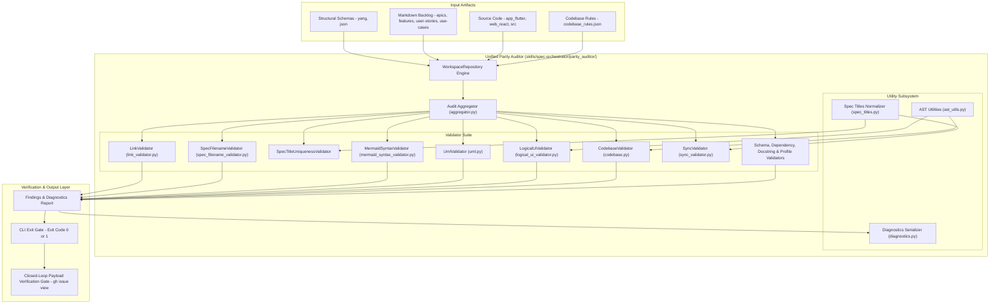
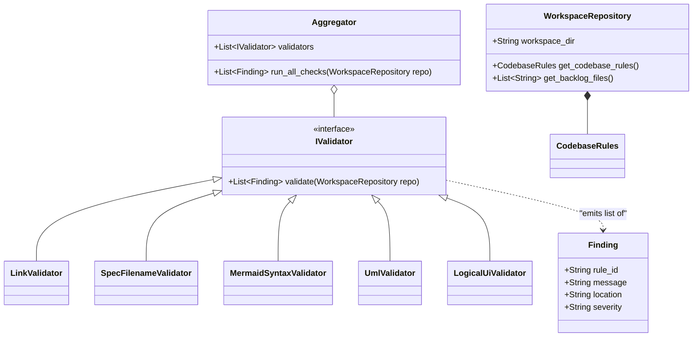
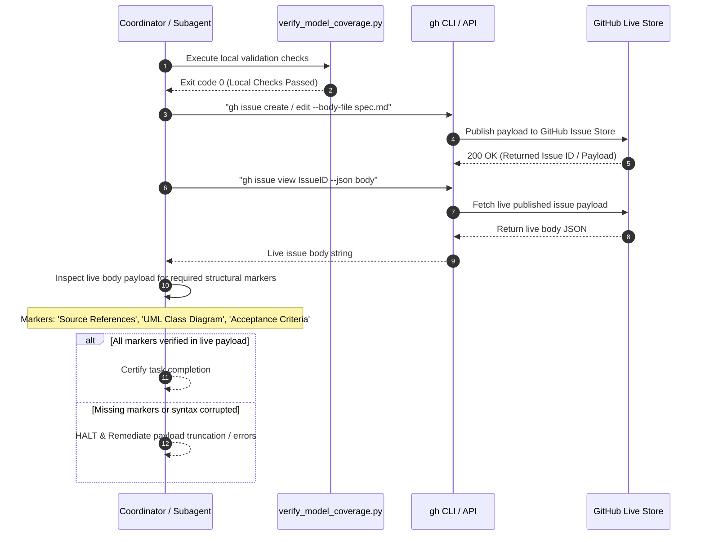
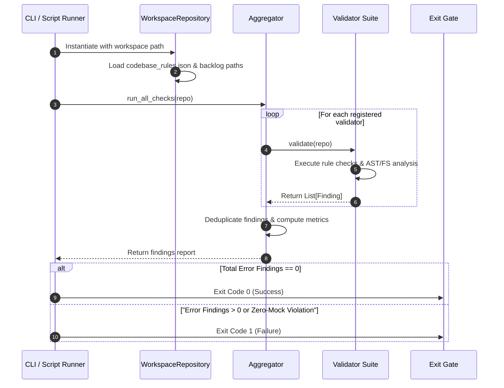
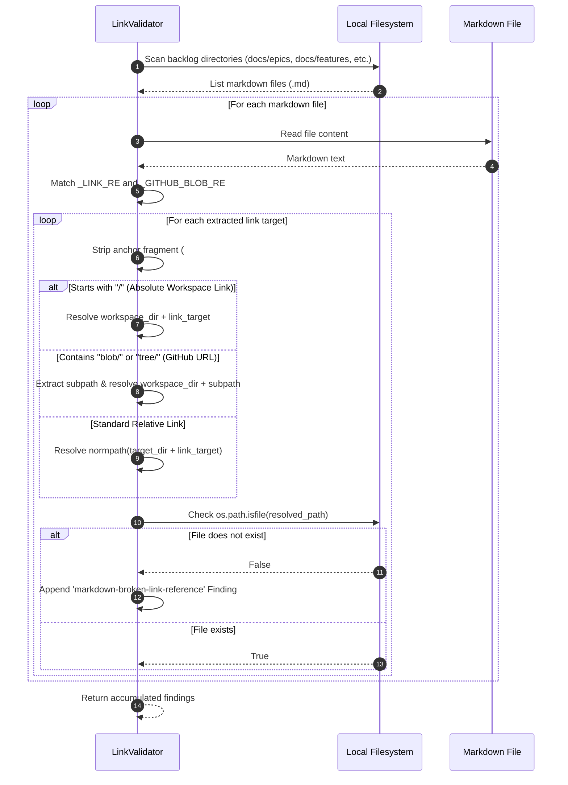

# Solution Architecture: DEAP Parity Auditor & Link Validator

## 1. Overview

The **Digital Engineering Automation Platform (DEAP) Parity Auditor & Link Validator** is the primary static verification engine within the digital pipeline ecosystem. It enforces zero-drift alignment across structural schemas (YANG models, JSON schemas), platform-independent Agile specification backlogs (Epics, Features, User Stories, Use Cases), visual UI layout contracts (`logical-layout.json`), target codebase implementations (Flutter, React, Python), and live GitHub issue tracking payloads.

In complex autonomous multi-agent development pipelines, specification drift, broken documentation links, non-rendering diagram syntax, and unverified issue updates degrade traceability and lead to silent failures. The Unified Parity Auditor provides a centralized, deterministic verification framework operating under strict engineering principles: zero-mocking execution, offline static rule enforcement, and closed-loop live payload verification.

> [!NOTE]
> The Parity Auditor runs as both a standalone python package (`parity_auditor` located at `skills/spec-orchestrator/parity_auditor/`) and an integrated verification tool (`skills/spec-orchestrator/scripts/verify_model_coverage.py`). It enforces compliance across 18 distinct static validators prior to git commits, backlog synchronization, or task completion.

---

## 2. Architectural Objectives

The Parity Auditor architecture is governed by six core engineering objectives:

1. **Static Zero-Drift Verification**: Perform multi-layered structural auditing across schema entities, specification documents, implementation ASTs, and backlog issue bodies to guarantee 100% specification model coverage.
2. **Deterministic Link Integrity**: Enforce broken-link verification across all markdown backlogs by parsing relative links, absolute workspace paths, and GitHub blob/tree URLs, verifying physical disk existence without remote network calls.
3. **Unified Slugification & Title Normalization**: Provide a single, canonical normalization engine shared across all gates and reconcilers to prevent alias collisions, duplicate issue creation, and filename drift.
4. **Rendering-Safe Diagram Enforcement**: Execute character-level static syntax analysis on Mermaid diagrams (headers, colons, stereotypes, braces, quoting, and angle-bracket escaping) to guarantee flaw-free rendering on GitHub UI and CLI tools.
5. **AST-Driven Implementation Coverage**: Parse Abstract Syntax Trees (AST) in target codebases to evaluate physical implementation coverage against logical schema definitions and detect forbidden constants (such as hardcoded color tokens).
6. **Closed-Loop Payload Verification**: Enforce the anti-complacency rule—exit code 0 alone is never proof of task success. Published GitHub payloads must be fetched and inspected empirically for required structural markers before certifying completion.

> [!IMPORTANT]
> **Zero-Mocking Policy**: The Parity Auditor strictly forbids mock CLI binaries or test runner stubs inside workspace directories (`scratch/bin/gh`, `scratch/bin/git`, `scratch/bin/flutter`). Execution against mock CLI tools results in immediate fatal termination.

---

## 3. System Boundary & Component Architecture

### 3.1 System Boundary

The Parity Auditor operates within the system context shown below. It ingests structural schema files, markdown specification backlogs, codebase source directories, and configuration rules. It interfaces with the local filesystem and the GitHub CLI (`gh`) to emit static findings, JSON diagnostics, exit codes, and live payload verifications.

### 3.2 Component Architecture Diagram



---

## 4. Detailed Technical Components

### 4.1 Unified Parity Auditor Core (`skills/spec-orchestrator/parity_auditor/`)

The Unified Parity Auditor is structured as a modular Python package located under `skills/spec-orchestrator/parity_auditor/src/parity_auditor/`.

* **`WorkspaceRepository` (`core/workspace.py`)**: Locates and abstracts workspace root, reading `.pipeline/logical-ui/codebase_rules.json` to configure backlog paths, repository metadata, and component mappings.
* **`IValidator` (`validators/base.py`)**: Abstract base interface enforcing `validate(self, repo: WorkspaceRepository, **kwargs) -> List[Finding]` across all concrete validators.
* **`Finding` (`core/findings.py`)**: Strongly-typed error payload capturing `rule_id`, `message`, `location`, and severity classification.
* **Aggregator Engine (`aggregator.py`)**: Instantiates the complete validator suite, executes validations sequentially or in parallel, deduplicates findings, and computes overall workspace coverage metrics.



---

### 4.2 Markdown Link Integrity Validator (`link_validator.py`)

The `LinkValidator` enforces 100% hyperlink integrity across all specification documents (`docs/epics/`, `docs/features/`, `docs/user-stories/`, `docs/use-cases/`).

1. **Link Extraction Regex**:
   * Standard Markdown Links: `_LINK_RE = re.compile(r'\[[^\]]+\]\(([^)]+)\)')`
   * GitHub Blob URLs: `_GITHUB_BLOB_RE = re.compile(r'https://github\.com/[^\s/]+/[^\s/]+/blob/[^\s/]+/[^\s\)\]\'">]+')`
2. **Anchor & Fragment Stripping**: Splits URLs on `#` to isolate target file paths from section anchors (`link.split('#')[0]`).
3. **Multi-Mode Path Resolution**:
   * **Relative Links**: Resolved relative to the containing specification directory (`os.path.normpath(os.path.join(target_dir, link_target))`).
   * **Absolute Workspace Links**: Starting with `/` (e.g., `/docs/features/feat-01.md`), resolved from workspace root (`os.path.join(workspace_dir, link_target.lstrip('/'))`).
   * **GitHub Blob/Tree URLs**: Extracts repository subpath following `blob/<branch>/` or `tree/<branch>/` and resolves against workspace root.
4. **Physical Disk Verification**: Evaluates `os.path.isfile(resolved_path)`. If false, emits a `markdown-broken-link-reference` finding.

> [!TIP]
> `LinkValidator` validates both local relative markdown paths and fully-qualified GitHub URLs in issue tasklists, ensuring links work seamlessly both in local IDEs and on GitHub web interfaces.

---

### 4.3 Unified Slugification & Filename Normalization

Specification filenames and backlog titles must obey rigid naming conventions to prevent collisions during automated issue reconciliation.

#### Filename Specification Regex (`_NAME_RE`)
Filename structure is enforced by `SpecFilenameValidator` via:
`^(?P<prefix>[a-z]+)-(?P<ordinal>\d+)-(?P<name>[a-z0-9]+(?:-[a-z0-9]+)*)\.md$`

* **Prefix Mapping**: `feat` for features, `epic` for epics, `us` for user stories, `uc` for use cases.
* **Stop-Word Preservation**: When converting titles to slugs (e.g., `feat-01-fiber-cable-and-strand-inventory.md`), stop-words (`and`, `the`, `of`) MUST be preserved.
* **Ordinal Uniqueness**: Asserts that numeric ordinals (e.g., `01`, `02`) are unique per backlog directory to prevent ambiguous reference targeting in `reconcile_backlog.py`.
* **Uniform Padding Width**: Mandates consistent zero-padding width within a directory (e.g., all 2-digit `01..99` or all 3-digit `001..999`) to preserve numerical order during lexical file sorting.

#### Shared Normalizer (`spec_titles.py`)
To prevent drift, `parity_auditor.utils.spec_titles` re-exports `reconcile_backlog.normalize_title` by reference (`normalize_spec_title = _load_reconciler().normalize_title`), guaranteeing that validation gates and reconciliation scripts share an identical title normalization algorithm.

---

### 4.4 Mermaid Syntax Validation Rules (`mermaid_syntax_validator.py`)

Mermaid diagrams embedded in markdown files must render flawlessly in GitHub previewers and CLI tools. `MermaidSyntaxValidator` performs character-level static analysis against documented rendering constraints:

1. **Mandatory Diagram Header Rule**: The first non-comment line inside every ```` ```mermaid ```` block MUST declare a valid header (`classDiagram`, `sequenceDiagram`, `stateDiagram-v2`, `graph TD`, `flowchart TD`, `erDiagram`, `gantt`, `pie`, `gitGraph`, `C4Context`). Missing or invalid headers trigger `mermaid-missing-diagram-header`.
2. **Semicolon Restrictions**: Semicolons (`;`) in `Note` statements or message text are strictly prohibited. Mermaid treats `;` as a statement separator, corrupting downstream line parsing (`mermaid-no-semicolon-in-note-or-message`).
3. **Class Diagram Colons**: Colons inside class member lines (e.g., `+method() : String`) are forbidden. Members must use standard spacing (`+String method()`). Colons in relationship labels must be quoted or stripped.
4. **Curly Braces in Members**: Curly braces (`{}`) inside class member lines are forbidden (e.g., use `(default earth)` instead of `{default earth}`) to prevent parser crashes.
5. **Single-Line Empty Class Bodies**: `class X {}` on a single line is forbidden. The same-line closing brace fails to close the block, causing subsequent classes to leak into wrong namespaces.
6. **Relationship Stereotypes**: Stereotypes (`<<references>>`, `«uses»`) on relationship lines are forbidden (`mermaid-no-stereotype-on-relationship`).
7. **Universal Angle Bracket Escaping**: Unquoted `<` and `>` characters across `graph`, `flowchart`, `sequenceDiagram`, and `stateDiagram` lines are forbidden. Labels/guards with comparison operators must be enclosed in double quotes (e.g., `"value < maxBound"`).
8. **Node Label Quoting**: Graph/flowchart node labels containing slashes, colons, parentheses, or brackets MUST be enclosed in double quotes (e.g., `Node["text"]`).
9. **Subgraph Title Quoting**: Subgraph titles containing spaces or hyphens MUST be enclosed in double quotes (e.g., `subgraph "System Boundary"`).
10. **Fence Closure Integrity**: All ```` ```mermaid ```` blocks MUST be explicitly closed with ```` ``` ```` on a separate line.

---

### 4.5 AST Coverage Calculation (`ast_utils.py` & Codebase Validators)

The Parity Auditor evaluates structural implementation completeness using Abstract Syntax Tree (AST) analysis.

* **Python AST Analysis**: `ast_utils.verify_python_ast` parses python files via `ast.parse()` and traverses nodes (`ast.walk`) to detect forbidden color constants, unhandled exceptions, or missing structural elements.
* **JSON/JS AST Analysis**: `ast_utils.walk_json_ast_for_compliance` recursively walks object trees to verify call expressions (`CallExpression`), member expressions (`MemberExpression`), and event method invocations (such as `stopPropagation`).
* **Model Coverage Ratio**:
  $$\text{Coverage \%} = \left( \frac{\text{Count of Schema Containers mapped to verified AST Class Nodes}}{\text{Total Count of Schema Containers in Specification Backlog}} \right) \times 100$$
  `CodebaseValidator` and `SchemaMappingValidator` assert that schema entities specified in feature frontmatter (`schema_containers`) have matching AST class representations in code.

---

### 4.6 Closed-Loop Payload Verification Gates

To eliminate optimism bias, task completion cannot be declared based solely on exit code 0 of local scripts.



* **Mandatory Post-Publish Check**: Immediately after creating or updating a GitHub issue, the agent MUST run:
  ```bash
  gh issue view <ID> --json body | python3 -c "import sys,json; b=json.load(sys.stdin)['body']; markers=['Source References','UML Class Diagram','Acceptance Criteria']; missing=[m for m in markers if m not in b]; assert not missing, f'Body incomplete: missing {missing}'"
  ```
* **Empirical Log Citation**: Verification reports must cite live stdout payload snippets proving markers exist on remote GitHub issues.

---

## 5. Sequence Flow Diagrams

### 5.1 Full Parity Audit Flow



---

### 5.2 Link Validation & Path Resolution Flow



---

## 6. CLI Integration Interfaces

The Parity Auditor exposes command-line interfaces for CLI integration, CI/CD runners, and agent validation hooks.

### 6.1 Invocation Commands

1. **Integrated Model Coverage Script**:
   ```bash
   ./skills/spec-orchestrator/scripts/verify_model_coverage.py --spec-only --allow-missing-specs
   ```
2. **Direct Package Entrypoint**:
   ```bash
   python3 -m parity_auditor.cli --workspace-dir . --json-output diagnostics.json
   ```

### 6.2 Command Line Options

| Flag | Type | Description |
| :--- | :--- | :--- |
| `--workspace-dir <path>` | String | Explicit target workspace directory (defaults to auto-discovered workspace root). |
| `--spec-only` | Flag | Restrict audit to specification backlogs and diagram syntax checks. |
| `--allow-missing-specs` | Flag | Permit unmapped schema entities during incremental feature engineering. |
| `--ignore-issues <list>` | String | Comma-separated issue numbers or ranges (e.g., `100-105,110`) to bypass in sync checks. |
| `--json-output <path>` | String | Path to serialize structured diagnostic findings payload. |

### 6.3 Environment Variables

* `PARITY_AUDITOR_GH_TIMEOUT`: Floating-point timeout in seconds for `gh` CLI subprocess execution (default: `3.0`).
* `OFFLINE`: When set to `1` or `true`, disables remote `gh` CLI calls and operates in local-only mode.

---

## 7. Verification Rules & Compliance Matrix

The table below summarizes the core verification rules enforced by the Parity Auditor:

| Rule ID | Validator Module | Failure Condition | Remediation Action |
| :--- | :--- | :--- | :--- |
| `markdown-broken-link-reference` | `link_validator.py` | Markdown link targets non-existent file path on disk | Update link target path to match actual file location |
| `spec-filename-format` | `spec_filename_validator.py` | Filename violates `<prefix>-<ordinal>-<kebab-name>.md` | Rename file using lowercase dash-separated convention |
| `spec-filename-ordinal-uniqueness` | `spec_filename_validator.py` | Duplicate numeric ordinal claimed by multiple files | Re-assign unique zero-padded ordinal to the file |
| `spec-filename-padding-consistency` | `spec_filename_validator.py` | Mixed ordinal digit widths in same directory | Apply uniform digit width (e.g., all 2-digit) across directory |
| `mermaid-missing-diagram-header` | `mermaid_syntax_validator.py` | First line inside mermaid block lacks valid header | Add valid header (e.g., `classDiagram`, `graph TD`) |
| `mermaid-no-semicolon-in-note-or-message` | `mermaid_syntax_validator.py` | Semicolon found in Note statement or message text | Replace semicolon with comma, dash, or space |
| `mermaid-no-colon-in-class-member` | `mermaid_syntax_validator.py` | Colon present in class member line | Format as `+ReturnType methodName(Type arg)` |
| `mermaid-no-curly-brace-in-class-member` | `mermaid_syntax_validator.py` | Curly brace `{}` present in class member line | Replace curly braces with parentheses `(default value)` |
| `mermaid-diagram-unquoted-brackets-forbidden` | `mermaid_syntax_validator.py` | Unquoted `<` or `>` character in transition/label | Enclose label or guard in double quotes `"val < max"` |
| `mermaid-node-label-must-be-quoted` | `mermaid_syntax_validator.py` | Unquoted special chars (`/`, `:`, `()`, `[]`) in node label | Enclose node label string in double quotes `Node["text"]` |
| `logical-ui-layout-bindings-required` | `logical_ui_validator.py` | UI feature missing `## Logical UI & Layout Bindings` | Add section mapping container to layout component |
| `ast-model-coverage-incomplete` | `codebase.py` | Schema entity unmapped to AST class node in code | Implement target AST class or update schema mapping |
