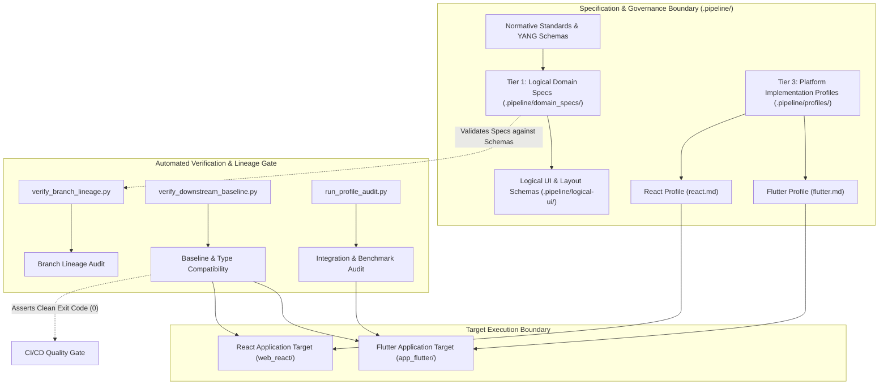
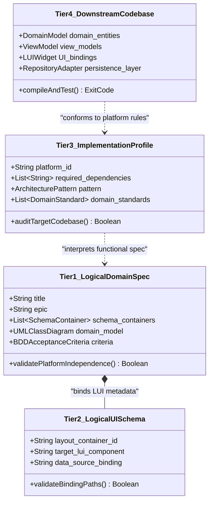
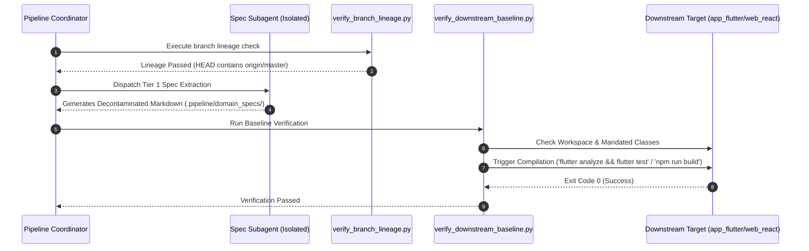
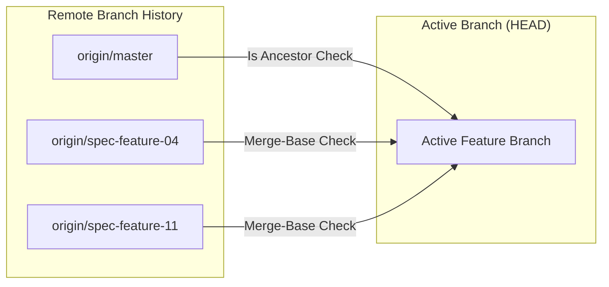

# DEAP Platform Decontamination Protocol — Solution Architecture

> [!NOTE]
> This document establishes the publication-grade solution architecture for the DEAP (Digital Engineering Automation Pipeline) Platform Decontamination Protocol. It governs the strict structural isolation, automated baseline verification, branch lineage tracking, and multi-tier specification management across all engineering repositories and downstream implementation targets.

---

## 1. Overview

The **DEAP (Digital Engineering Automation Pipeline) Platform Decontamination Protocol** provides a rigorous architectural framework designed to decouple high-level domain semantics from platform-specific technical execution. In complex enterprise engineering environments, specifications frequently suffer from *technology contamination*—the accidental inclusion of framework-specific constructs (e.g., React hooks, Flutter `Widget` bindings, platform UI layouts, or database ORM schemas) directly within normative business logic and structural domain definitions.

This contamination creates vendor lock-in, inflates context window bloat for AI development agents, and prevents cross-platform target reusability. The DEAP Decontamination Protocol resolves this by introducing a strict **4-Spec Decontamination Model**, backed by automated lineage verification, downstream baseline validation gates, and dynamic profile inheritance.

> [!TIP]
> By enforcing platform decontamination, a single set of logical domain specifications stored in `.pipeline/domain_specs/` can deterministically drive multiple implementation targets (such as Flutter desktop/mobile apps and React web applications) with zero specification drift.

---

## 2. Architectural Objectives

The DEAP Platform Decontamination Architecture satisfies five core objectives:

1. **Strict Platform Independence (Tier 1 Isolation)**: Ensure logical Epics, Features, User Stories, and Use Cases are purely functional and platform-agnostic, describing *what* the system does without asserting *how* it is implemented on a specific runtime.
2. **Deterministic Profile Inheritance (Tier 3 Binding)**: Formally bind abstract domain classifiers to concrete target frameworks (e.g., Dart/Flutter SDK 3.44.0 or React 18/TypeScript) through declarative implementation profiles (`.pipeline/profiles/`).
3. **Automated Downstream Baseline Verification**: Guarantee that target application repositories (`app_flutter/`, `web_react/`) conform to required baseline architectures, compile cleanly, pass test suites, and expose no unauthorized domain leakage via `scripts/verify_downstream_baseline.py`.
4. **Immutable Branch Lineage Validation**: Enforce upstream branch synchronization via `scripts/verify_branch_lineage.py`, ensuring active feature branches maintain ancestor traceability with `origin/master` and incorporate all unmerged specification changes.
5. **Zero-Mocking Live Persistence & 3-Layer LUI Compliance**: Require all presentation layers to bind dynamically to clean ViewModel contracts and live persistent data sources (Firestore, local SQLite, or gNMI telemetry) rather than transient in-memory UI mocks.

---

## 3. System Boundary & Component Architecture

The DEAP platform establishes explicit boundaries between specification authoring, validation tooling, profile resolution, and downstream target execution.



### Component Roles & Interfaces

| Component | Path | Responsibility | Primary Interface / Tool |
| :--- | :--- | :--- | :--- |
| **Logical Domain Specs** | `.pipeline/domain_specs/` | Platform-independent functional specifications (Epics, Features, Use Cases). | Markdown + YAML Frontmatter |
| **Logical UI Schemas** | `.pipeline/logical-ui/` | Layout containers, component bindings, and data source paths. | `logical-layout.json` |
| **Platform Profiles** | `.pipeline/profiles/` | Technology stack rules, coding standards, and platform audit gates. | `flutter.md`, `react.md` |
| **Branch Lineage Script** | `scripts/verify_branch_lineage.py` | Validates git branch ancestor lineage against `origin/master`. | Git CLI / Python 3 |
| **Baseline Verifier** | `scripts/verify_downstream_baseline.py` | Validates mandated classes, workspace cleanliness, and compilation. | `npm run build` / `flutter test` |
| **Profile Auditor** | `scripts/run_profile_audit.py` | Executes multi-node performance profiling and benchmark parsing. | Benchmark JSONL Logger |

---

## 4. The 4-Spec Decontamination Model

The foundation of the DEAP protocol is the **4-Spec Decontamination Model**, which separates specifications into four distinct tiers of responsibility.



### Detailed Spec Tier Specifications

#### 1. Tier 1: Logical Domain Specifications (`.pipeline/domain_specs/` & `docs/`)
- **Location**: `.pipeline/domain_specs/`, `docs/epics/`, `docs/features/`, `docs/use-cases/`, `docs/user-stories/`
- **Scope**: Platform-agnostic domain logic derived from YANG schemas or normative technical standards.
- **Constraints**: 
  - Must NOT reference platform-specific frameworks (e.g. Flutter, React, Android, iOS).
  - Must model data entities using standard UML primitives (`String`, `Integer`, `Real`, `Boolean`).
  - Must include Given-When-Then BDD acceptance criteria.

> [!IMPORTANT]
> The coordinator and specification subagents are strictly prohibited from embedding framework-specific keywords, platform-specific libraries, or local environment paths within Tier 1 logical domain specifications.

#### 2. Tier 2: Logical UI & Layout Schemas (`.pipeline/logical-ui/`)
- **Location**: `.pipeline/logical-ui/logical-layout.json`, `codebase_rules.json`
- **Scope**: Structural definitions of abstract UI containers, viewport bounds, and schema path bindings.
- **Constraints**:
  - Maps domain leaf paths (e.g., `/nwi:network-inventory/nil:locations/nil:location`) to abstract layout container IDs (e.g., `properties_view`, `components_table`).
  - Strict prohibition against static pixel offsets or inline styling.

#### 3. Tier 3: Platform Implementation Profiles (`.pipeline/profiles/`)
- **Location**: `.pipeline/profiles/flutter.md`, `.pipeline/profiles/react.md`
- **Scope**: Platform-specific execution rules, coding conventions, architectural patterns (MVVM, Clean Architecture), and mandatory domain engineering standards.
- **Constraints**:
  - Defines mandated dependencies (e.g. `sqflite_common_ffi`, `cloud_firestore`).
  - Mandates error handling patterns (e.g. `Result<T>` sealed hierarchies for Flutter, discriminated unions for React).

#### 4. Tier 4: Downstream Target Application Codebases (`app_flutter/`, `web_react/`)
- **Location**: `app_flutter/`, `web_react/`
- **Scope**: Concrete source code implementation executing on target runtimes.
- **Constraints**:
  - Must enforce the **3-Layer Definition of Done**: (1) Clean Domain Entity, (2) ViewModel state container, and (3) LUI Widget Binding with verified BDD tests asserting **User Event → ViewModel Action → State Mutation → LUI Render**.

---

## 5. Decontamination Protocol Execution Pipeline

The decontamination lifecycle transforms raw structural specifications into verified target applications through a multi-stage automated loop.



### Stage Summary

1. **Pre-Flight Lineage Audit**: Validate git ancestral history against remote tracking branches.
2. **Isolated Spec Extraction**: Dispatch context-isolated subagents to extract decontaminated Tier 1 functional models.
3. **Profile Resolution**: Cross-reference functional models against target platform profiles (`.pipeline/profiles/`).
4. **Downstream Compilation & Baseline Verification**: Execute automated build tools against target source directories, asserting zero compilation warnings and 100% test passing.

---

## 6. Baseline Downstream Verification & Quality Gates

Baseline downstream verification is enforced by `scripts/verify_downstream_baseline.py`. It operates as an impenetrable gate prior to code integration.

> [!WARNING]
> An exit code of `0` from compilation commands is a necessary but non-sufficient condition. Verification failure occurs if workspace locks exist, mandated classes are omitted, or unmerged remote branch changes are detected.

### Verification Tasks Performed by `verify_downstream_baseline.py`

1. **Restoration Point Tagging (`tag_restoration_point`)**:
   - Executes `git tag -f restoration-point` on current `HEAD` to provide an instant rollback point if verification fails.
2. **Workspace Sanitation (`cleanup_workspace`)**:
   - Cleans stale lockfiles (`.dart_tool/package_config.json.lock`), plugin cache files (`.flutter-plugins`), temporary SQLite database logs (`.db-shm`, `.db-wal`), and intermediate build directories (`build/`).
3. **Domain Configuration Audit (`check_no_domain_config`)**:
   - Inspects `codebase_rules.json` and `baseline_manifest.json` to verify that no unauthorized domain-specific configuration overrides have been injected into baseline runtime profiles.
4. **Mandated Class & Type Audit (`load_mandated_classes`)**:
   - Asserts that all core domain interfaces and entities declared in `mandated_classes` exist within `types.dart` (Flutter) or `types.ts` (React) and strictly conform to specified field signatures.
5. **Automated Application Compilation & Test Suite Execution**:
   - **Flutter Target**: Executes `flutter analyze && flutter test` inside `app_flutter/`. Halts on any warning or failed test.
   - **React Target**: Executes `npm run build` inside `web_react/`. Halts on any TypeScript compilation error or bundle failure.

---

## 7. Branch Lineage Validation & Profile Inheritance

### Branch Lineage Validation (`verify_branch_lineage.py`)

To prevent specification divergence across distributed agent teams, `scripts/verify_branch_lineage.py` performs strict ancestry verification:

- **Ancestor Assertion**: Verifies `git merge-base --is-ancestor origin/master HEAD`. If the active branch is behind `origin/master`, execution halts immediately.
- **Unmerged Remote Specification Branch Audit**: Inspects all active remote branches (`git branch -r --no-merged origin/master`). Ensures `HEAD` has merged or contains all unmerged remote specification branches before allowing push operations.



### Profile Inheritance Hierarchy

Implementation profiles inherit rules hierarchically to guarantee project-wide consistency:

```
[Project Constitution (.pipeline/constitution.md)]
       │ (Defines global domain engineering rules & zero-mocking mandate)
       ▼
[Platform Implementation Profile (.pipeline/profiles/<platform>.md)]
       │ (Defines platform SDK, architecture pattern, and linter rules)
       ▼
[Concrete Target Adapters (app_flutter/lib/adapters/ & web_react/src/adapters/)]
       │ (Implements clean repository interfaces over live databases)
       ▼
[Presentation Layer (ViewModels + LUI Widgets)]
```

---

## 8. Summary & Governance Compliance

The DEAP Platform Decontamination Protocol establishes an airtight engineering standard that bridges high-level specification engineering and multi-target code execution. By enforcing the **4-Spec Model**, **Branch Lineage Verification**, and **Baseline Downstream Validation**, the pipeline eliminates technology contamination, guarantees cross-platform reusability, and maintains zero specification drift across all target applications.

### 4-Point Compliance Matrix

- **Karpathy Verification**: All changes strictly verified via automated baseline compilation (`flutter analyze`, `flutter test`, `npm run build`).
- **No Over-Engineering**: Utilizes lightweight, single-purpose Python scripts for verification without introducing complex build dependencies.
- **Surgical Changes**: Operations restricted exclusively to defined specification directories and project targets.
- **CMMI Level 3 Compliance**: Maintains clear separation between automated Verification (`Fixed / Resolved`) and Product Owner Validation (`Closed`).

---
