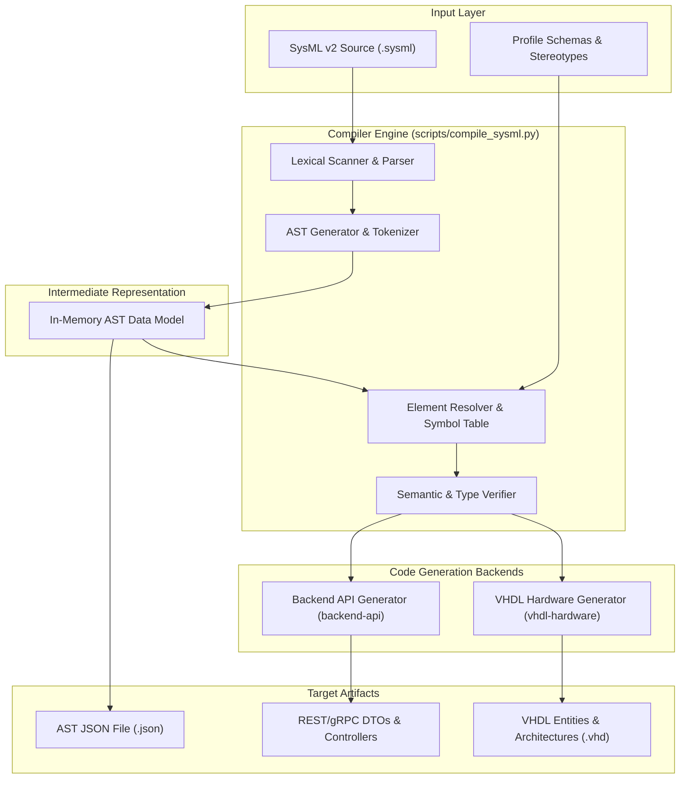
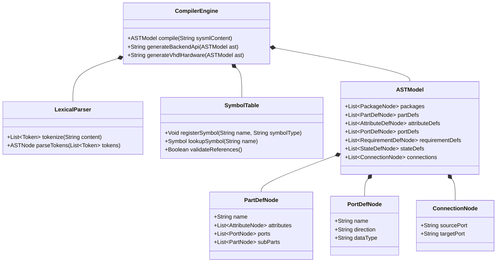
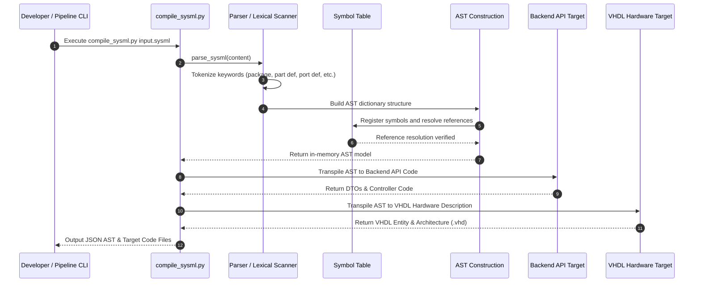

# Solution Architecture: SysML v2 AST Compiler

## 1. Overview

The **SysML v2 AST Compiler** is a core transformation component within the Digital Engineering Automation Platform (DEAP). It parses textual OMG Systems Modeling Language Version 2 (SysML v2) source files, tokenizes architectural constructs into an Abstract Syntax Tree (AST), resolves semantic element relationships, and transpiles the validated AST model into executable software and hardware downstream target artifacts.

Modern digital engineering pipelines require seamless traceability between high-level system requirements, structural architecture, software API endpoints, and physical hardware implementations. The SysML v2 AST Compiler acts as the translation bridge, converting SysML v2 kerML and textual domain declarations into strongly-typed representations suitable for API code generation and hardware description synthesis.

> [!NOTE]
> The compiler pipeline processes SysML v2 textual syntax (`.sysml`), builds an intermediate JSON-serializable AST representation, and provides modular target codegen backends for both API services (`backend-api`) and synthesizable VHDL modules (`vhdl-hardware`).

---

## 2. Architectural Objectives

The compiler architecture is governed by five primary design principles:

1. **Grammatical Precision & Extensibility**: Execute deterministic lexical scanning and AST generation for SysML v2 kerML structural and behavioral constructs (packages, part definitions, port definitions, requirements, and state definitions).
2. **Decoupled Multi-Target Transpilation**: Isolate core AST parsing from target code generation. Target code generators for `backend-api` and `vhdl-hardware` consume verified AST data models via standardized interfaces without re-parsing raw source text.
3. **Exhaustive Element & Connection Resolution**: Resolve cross-element symbol definitions, namespace scoping, port directionality (`in`, `out`, `inout`), connector bindings, and requirement satisfaction links.
4. **Fail-Fast Verification & Diagnostics**: Provide strict static verification rules (unresolved symbol detection, type mismatches, connection orientation errors) with informative diagnostic output.
5. **Platform Independence**: Ensure zero dynamic runtime dependencies for core AST compilation (`scripts/compile_sysml.py`), enabling execution in CLI environments, CI/CD runners, and edge automation agents.

---

## 3. System Boundary & Component Architecture

### 3.1 System Boundary

The compiler operates within the system context shown below. It ingests SysML v2 source files (`.sysml`) alongside optional profile schemas/stereotypes, and produces AST JSON payloads, Backend API DTOs/controllers, and VHDL hardware entities.

### 3.2 Component Architecture Diagram



> [!IMPORTANT]
> The compiler pipeline strictly enforces unidirectional data flow. Lexical parsing and AST construction precede any code generation step, guaranteeing that backends only process semantically valid AST representations.

---

## 4. Compiler Internals & AST Pipeline (`scripts/compile_sysml.py`)

### 4.1 Parser Mechanism & Tokenization

The core compiler script (`scripts/compile_sysml.py`) executes multi-pass lexical scanning over SysML v2 textual input. It matches structural syntax patterns to build a canonical AST schema containing six primary element categories:

* **Packages (`packages`)**: Logical namespace containers (`package <Name>`).
* **Part Definitions (`part_defs`)**: Structural component definitions (`part def <Name>`).
* **Attribute Definitions (`attribute_defs`)**: Value property and primitive type definitions (`attribute def <Name>`).
* **Port Definitions (`port_defs`)**: Interface point definitions (`port def <Name>`).
* **Requirement Definitions (`requirement_defs`)**: System specification and constraint definitions (`requirement def <Name>`).
* **State Definitions (`state_defs`)**: Behavioral state machine definitions (`state def <Name>`).

### 4.2 Element Resolution Pipeline

The compiler resolves symbolic references across five structural domains:

1. **Packages**: Scope isolation and fully-qualified name (FQN) resolution for nested namespaces.
2. **Parts (`part def` / `part`)**: Decomposition of component definition blocks, sub-part instantiations, and structural hierarchy trees.
3. **Ports (`port def` / `port`)**: Directionality binding (`in`, `out`, `inout`), data type assignment, and interface compatibility checking.
4. **Connections (`connect`)**: Endpoint mapping connecting source ports to target ports across part boundaries.
5. **Requirements (`requirement def` / `requirement`)**: Textual requirement specification, ID allocation, and verification/satisfy relationship mapping.

### 4.3 AST Core Class Diagram



---

## 5. Code Generation Targets

### 5.1 Target 1: Backend API Generation (`backend-api`)

The `backend-api` target transpiles SysML v2 structural definitions into web service and API artifacts:

* **DTO Class Generation**: Translates `part def` and `attribute def` elements into strongly-typed DTOs (Data Transfer Objects) for REST/gRPC payloads.
* **Service Endpoints**: Maps `port def` interface definitions to API routes and service methods.
* **Requirement Trackers**: Generates validation middleware to trace incoming API requests against `requirement def` constraints.

### 5.2 Target 2: VHDL Hardware Description (`vhdl-hardware`)

The `vhdl-hardware` target converts SysML v2 structural models into synthesizable VHDL:

* **VHDL Entities**: Maps `part def` elements directly to VHDL `entity <name> is` declarations.
* **VHDL Ports**: Translates `port def` directionality into VHDL port signals:
  * `in` $\rightarrow$ `in std_logic` / `in std_logic_vector`
  * `out` $\rightarrow$ `out std_logic` / `out std_logic_vector`
  * `inout` $\rightarrow$ `inout std_logic`
* **Port Maps & Connections**: Transpiles `connect` bindings into structural `port map` instantiations in the VHDL `architecture`.

> [!TIP]
> Hardware description generation enables automated conversion of SysML system architecture diagrams directly into hardware testbenches and FPGA top-level wrappers.

---

## 6. Data Flow Sequence Diagram

The compilation and artifact generation process follows the sequence illustrated below:



---

## 7. Profile Schema Mapping & Stereotype Extensions

### 7.1 Profile Integration

The SysML v2 AST Compiler supports profile extensions for domain-specific metadata. Profiles allow annotating SysML elements with target generation directives:

| SysML v2 Construct | Profile Stereotype | Backend API Mapping | VHDL Hardware Mapping |
| :--- | :--- | :--- | :--- |
| `part def` | `@hardware_component` | Service Controller | VHDL Entity / Architecture |
| `part def` | `@api_resource` | REST Resource DTO | N/A (Excluded) |
| `port def` | `@bus_interface` | gRPC Channel / WebSockets | VHDL Bus Signal (`std_logic_vector`) |
| `attribute def` | `@config_parameter` | JSON App Setting | VHDL Generic Parameter |

### 7.2 Type System Mapping Table

```
SysML v2 Primitive   -->   Backend API Type   -->   VHDL Hardware Type
------------------         ----------------         ------------------
Boolean                    Boolean                  std_logic
Integer                    int32 / int64            integer / std_logic_vector
Real                       float64                  real / fixed-point
String                     String                   string (simulation only)
```

---

## 8. Error Handling Strategies & Verification Rules

### 8.1 Verification Rules Matrix

The static verifier enforces four mandatory semantic rules before triggering target transpilation:

1. **Symbol Resolution Rule**: Every `part`, `port`, or `connection` reference MUST resolve to a valid definition within the `SymbolTable`.
2. **Type Compatibility Rule**: Connected source and target ports MUST have matching data types.
3. **Directional Flow Rule**: Connections MUST pair output ports (`out`) with input ports (`in`), or bidirectional ports (`inout` with `inout`). Direct `in` to `in` or `out` to `out` connections are rejected.
4. **Namespace Uniqueness Rule**: Identifiers within the same package scope MUST be unique. Duplicate definitions trigger compilation failure.

### 8.2 Error Reporting & Diagnostics

* **Line & Column Anchoring**: Errors cite explicit line numbers and token context for syntax failures.
* **Fail-Fast Exit Codes**: Unresolved references or semantic errors produce a non-zero exit code (`exit code 1`), halting downstream automated pipeline steps.
* **Diagnostic Warnings**: Non-critical issues (e.g., unconnected ports, unreferenced requirements) generate diagnostic warnings without failing the compilation step.
